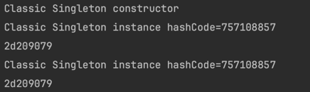
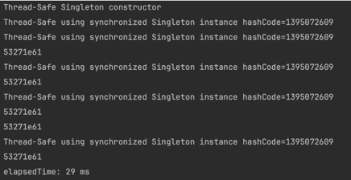
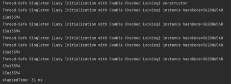

## 디자인 패턴

---

### Singleton Pattern
- 하나의 클래스에 오직 하나의 인스턴스만!
- 하나의 인스턴스로 모두가 공유해 사용하기 때문에 비용 감소!
- but, 의존성이 높아질 수 있음
- 데이터베이스 연결 모듈이 많이 쓰인다.

---

### Java의 싱글톤 패턴 - Classic한 방법
1. default constructor를 private로
   - 이 클래스를 new로 객체 생성하지 않겠다는 뜻
   - 외부에서 해당 클래스의 객체 직접 생성 불가능
2. static 필드로 싱글톤 인스턴스 생성
   - 클래스 내부에 자체 유일한 인스턴스를 저장할 정적 필드 생성
3. static facctory 메서드 사용
   - 유일하게 공유되는 싱글톤 인스턴스를 반환 (외부에서 호출 가능)

```java
public class Singleton {
	// 2. static 필드
	private static Singleton instance = null;
	
	// 1. private default 생성자
	private Singleton() {
		System.out.println("Classic Singleton constructor");
	}
	
	// 3. static 메소드
	public static Singleton getInstance() {
		if (instance == null)
			instance = new Singleton();
		return instance;
	}
	
	public void print() {
		System.out.println("Classic Singleton instance hashCode=" + instance.hashCode());
	}
}
```

- 생성자는 딱 한 번 호출됨
- 그 이후로는 동일한 싱글톤 인스턴스 반환

그러나 classic한 방법은 멀티 쓰레드 환경에서 실행해보면 쓰레드마다 다른 인스턴스를 반환한다. 여러 스레드가 동시에 getInstance()를 호출하면 인스턴스가 여러 번 생성될 수 있기 때문이다.

---

### Java의 싱글톤 패턴 - Thread-Safe한 방법
- 기존 classic한 방법이 해결하지 못한 멀티 쓰레드 환경에서도 공유가 가능하도록 한다.
- `synchronized` 키워드를 통해 코드 블럭을 동기화 시켜줘 한 번에 한 쓰레드만 생성자 코드 블럭에 접근할 수 있도록 한다.
```java
public class Singleton {

	private static Singleton instance = null;
	
	private Singleton() {
		System.out.println("Thread-Safe Singleton constructor");
	}
	
	// thread-safe using synchronized
	public synchronized static Singleton getInstance() {
		if (instance == null)
			instance = new Singleton();
		return instance;
	}
	
	public void print() {
		System.out.println("Thread-Safe using synchronized Singleton instance hashCode=" + instance.hashCode());
	}
}
```

- 이제 멀티 쓰레드 환경에서도 싱글톤 인스턴스가 유지된다.

**Thread-Safe 싱글톤 (Lazy Initialization with DCL)**
- 성능을 위해 정말 필요한 부분만 `synchronized`를 적용해 동기화를 최소화하는 방법
- DCL 사용법
  1. First Check
     - getInstance 메서드가 호출될 때 인스턴스가 이미 생성되었는지 확인 -> `synchronized` 사용 X
  2. Second Check
     - 인스턴스가 생성되지 않았다면 그때서야 'synchronized' 사용해 인스턴스 생성

```java
// Double Checked Locking
public class Singleton {
        // volatile은 변수를 메인 메모리에 생성해 동기화 상태로 만드는 키워드
        // 멀티 스레드가 해당 변수에 접근할 때 CPU 캐시가 아닌 메인 메모리에서 작업
	private static volatile Singleton instance = null;
	
	private Singleton() {
		System.out.println("Thread-Safe Singleton (Lazy Initialization with Double Checked Locking) constructor");
	}
	
	public static Singleton getInstance() {
                // First Check
		if (instance == null) {
                        // Second Check
			synchronized (Singleton.class) {
				if (instance == null)
					instance = new Singleton();				
			}
		}
		return instance;
	}
	
	public void print() {
		System.out.println("Thread-Safe Singleton (Lazy Initialization with Double Checked Locking) instance hashCode=" + instance.hashCode());
	}
}
```


---

### Java의 싱글톤 패턴 - Inner Static Class 사용
- static은 정적으로 로딩될 때 불려지는데 static 클래스 안에 static final로 싱글톤 인스턴스를 생성한다.
```java
class Singleton {
    // 1. Singleton 클래스 내에 정적(static) inner 클래스 ->  외부 클래스(Singleton)의 인스턴스를 하나만 갖도록
    private static class singleInstanceHolder {
        // 2. final 키워드로 최초에만 초기화되도록
        // singleInstanceHolder 클래스가 로드될 INSTANCE가 초기화 (lazy initialization) 
        private static final Singleton INSTANCE = new Singleton();
    }
    
    // synchronized 키워드를 사용하여 멀티스레드 환경에서도 안전하게 인스턴스를 반환
    public static synchronized Singleton getInstance() {
        return singleInstanceHolder.INSTANCE;
    }
}
```
---

### 싱글톤 패턴의 단점
- TDD(Test Driven Development) 시 단위 테스트는 테스트가 서로 독립적이어야 하는데 싱글톤 패턴은 독립적인 인스턴스를 생성하기 어려움
- 모듈 간의 결합을 강하게 만들 수 있음
  - 의존성 주입(DI. Dependency Injection)을 통해 모듈 간의 결합을 느슨하게 만들어 해결 가능
    - 의존성 주입은 추상화에 의존해야 하며 추상화는 세부 사항에 의존하면 안됨
    - 모듈들을 쉽게 교체할 수 있는 구조 구축
    - 테스트, 마이그레이션 용이


