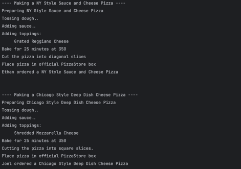

## 팩토리 패턴
객체 생성 로직을 추상화한 패턴으로 상위 클래스에서 뼈대만 결정하고 구체적인 객체 생성 방법은 하위 클래스에서 구체화하는 패턴이다. 

---

### 팩토리 패턴 메서드 특징
1. 객체 생성 로직 캡슐화
   - 클라이언트는 구체 클래스를 직접 생성하지 않고 팩토리 메서드 호출해서 객체 생성
2. 서브 클래스에 유연성 제공
   - 서브 클래스에서 어떤 구체 클래스의 인스턴스를 생성할지 결정할 수 있고, 필요에 따라 객체 생성 방법 변경도 가능하다.
3. `new` 연산자 회피
   - `new`를 이용해 직접 객체 생성하는 것을 회피하므로 객체 생성 로직을 런타임에 변경 가능

### 팩토리 패턴 적용 전 코드
**피자 생성 및 주문 로직**
```java
class PizzaOrder {
    public Pizza orderPizza(String type) {
        Pizza pizza = null;

        if (type.equals("cheese")) {
            pizza = new CheesePizza();
        } else if (type.equals("pepperoni")) {
            pizza = new PepperoniPizza();
        } else if (type.equals("clam")) {
            pizza = new ClamPizza();
        } else if (type.equals("veggie")) {
            pizza = new VeggiePizza();
        }

        if (pizza != null) {
            prepareToBoxing(pizza);
        }

        return pizza;
    }

    private void prepareToBoxing(Pizza pizza) {
        pizza.prepare();
        pizza.bake();
        pizza.cut();
        pizza.box();
    }
}
```

팩토리 패턴이 적용되지 않은 코드는 수정에 닫혀있다. 만약 다른 타입의 피자 생성 로직을 추가하거나 삭제할 때마다 주문 클래스의 코드 수정이 필요하게 된다.

### 팩토리 패턴 적용 후 코드
**피자 주문 클래스에서 피자 생성 로직 분리**
```java
class PizzaFactory {
    public Pizza createPizza(String type) {
        Pizza pizza = null;
        
        switch (type.toLowerCase()) {
            case "cheese":
                pizza = new CheesePizza();
                break;
            case "pepperoni":
                pizza = new PepperoniPizza();
                break;
            case "clam":
                pizza = new ClamPizza();
                break;
            case "veggie":
                pizza = new VeggiePizza();
                break;
            default:
                System.out.println("Invalid pizza type");
                break;
        }
        
        return pizza;
    }
}
```

**주문 클래스**
```java
class PizzaOrder {
    private PizzaFactory pizzaFactory;

    public PizzaOrder(PizzaFactory factory) {
        this.pizzaFactory = factory;
    }

    public Pizza orderPizza(String type) {
        Pizza pizza = pizzaFactory.createPizza(type);

        if (pizza != null) {
            prepareToBoxing(pizza);
        }

        return pizza;
    }

    private void prepareToBoxing(Pizza pizza) {
        pizza.prepare();
        pizza.bake();
        pizza.cut();
        pizza.box();
    }
}
```

이제 새로운 피자를 추가하거나 수정할 때 PizzaFactory 클래스만 수정하면 된다. 각 클래스가 생성, 주문을 담당하므로 단일 책임 원칙도 잘 지켜진다. 

---

## 추상 팩토리 패턴
추상 팩토리 패턴(Abstract Factory Pattern)은 구체적인 클래스를 지정하지 않고 관련 객체의 패밀리를 생성하기 위한 인터페이스를 제공하는 패턴이다. 이 패턴을 사용하면 객체 생성 코드를 캡슐화하고, 제품군(product family) 전체를 일관되게 생성할 수 있다.

위 피자 예제를 다시 생각해보자. 여러 지점의 피자 프랜차이즈 가맹점을 관리하는 상황일 때 팩토리 메서드 패턴을 활용해 각 가맹점에서 원하는 스타일의 피자를 만들 수 있도록 할 수 있다.

**추상 팩토리**
- 피자 주문 및 제조 프로세스를 표준화
- 각 프랜차이즈에게 각 스타일을 설정할 수 있는 방법을 제공한다.
```java
public abstract class PizzaStore {
   // 팩토리 메서드: 각 프랜차이즈별로 구현될 것
   public abstract Pizza createPizza(String type); 

   public Pizza orderPizza(String type) {
      Pizza pizza = createPizza(type);
      System.out.println("---- Making a " + pizza.getName() + " ----");
      prepareToBoxing(pizza);
      return pizza;
   }

   void prepareToBoxing(Pizza pizza) {
      pizza.prepare();
      pizza.bake();
      pizza.cut();
      pizza.box();
   }
}
```

**각 지역별 서브 클래스**
```java
public class ChicagoPizzaStore extends PizzaStore {

	@Override
	public Pizza createPizza(String type) {
		if (type.equals("cheese"))
			return new ChicagoCheesePizza();
		else if (type.equals("pepperoni"))
			return new ChicagoPepperoniPizza();
		else if (type.equals("clam"))
			return new ChicagoClamPizza();
		else if (type.equals("veggie"))
			return new ChicagoVeggiePizza();
		else
			return null;
	}

}

public class NYPizzaStore extends PizzaStore {

	@Override
	public Pizza createPizza(String type) {
		if (type.equals("cheese"))
			return new NYStyleCheesePizza();
		else if (type.equals("pepperoni"))
			return new NYStylePepperoniPizza();
		else if (type.equals("clam"))
			return new NYStyleClamPizza();
		else if (type.equals("veggie"))
			return new NYStyleVeggiePizza();
		else
			return null;
	}

}
```

**MainTest - 사용 예제**
```java
public class Main {
   public static void main(String[] args) {
      PizzaStore nyStore = new NYPizzaStore();
      PizzaStore chicagoStore = new ChicagoPizzaStore();

      String[] types = {"cheese"};
      Pizza pizza = null;
      
      for (String type : types) {
         pizza = nyStore.orderPizza(type);
         System.out.println("Ethan ordered a " + pizza.getName() + "\n\n");

         pizza = chicagoStore.orderPizza(type);
         System.out.println("Joel ordered a " + pizza.getName() + "\n\n");
      }
   }
}
```


### 팩토리 패턴 - 커피 주문 예제
```java
// 커피 추상 클래스
abstract class Coffee {
    // 팩토리 메서드 - 각 메뉴에서 구체적으로 구현
    public abstract int getPrice();
    
    @Override
    public String toString() {
        return "Hi this coffee is " + this.getPrice();
    }
}

// 커피 주문 클래스
class CoffeeFactory {
    public static Coffee getCoffee(String type, int price) {
        if ("Latte".equalsIgnoreCase(type)) 
            return new Latte(price);
        else if ("Americano".equalsIgnoreCase(type)) 
            return new Americano(price);
        else
            return new DefaultCoffee();
    }
}
```

```java
// 디폴트
class DefaultCoffee extends Coffee {
    private int price;
    
    public DefaultCoffee() {
        this.price = -1;
    }
    
    @Override
    public int getPrice() {
        return this.price;
    }
}

// 라떼
class Latte extends Coffee {
   private int price;

   public Latte() {
      this.price = price;
   }

   @Override
   public int getPrice() {
      return this.price;
   }
}

// 아메리카노 라떼와 구조 동일 ..
```

**커피 주문 예제**
```java
public class CoffeeOrder {
    public static void main(String[] args) {
        Coffee latte = CoffeeFactory.getCoffee("Latte", 4000);
        Coffee ame = CoffeeFactory.getCoffee("Americano", 3000);

       System.out.println("Factory latte :: " + latte); 
       System.out.println("Factory ame :: " + ame);
    }
}

/* 출력
      Factory latte :: Hi this coffee is 4000  
      Factory ame :: Hi this coffee is 3000  
 */
```