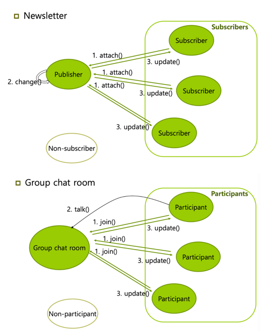
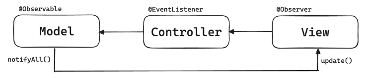

## 옵저버 패턴
주체가 어떤 객체의 상태가 변경되었을 때 옵저버들에게 자동으로 알림을 전달하고 업데이트를 수행하게 하는 패턴

**주체**
- 객체의 상태 변화를 보고 있는 관찰자

**Observer**
- 감시중인 객체의 상태 변화에 따라 알림을 받아 업데이트를 수행하는 객체

> 주체와 객체를 따로 두지 않고 상태가 변경되도록 구축하기도 한다.

---

### 옵저버 패턴 작동 원리
1. Subject 객체는 자신의 상태가 변경되었을 때 모든 Observer 객체에게 알림
2. Observer 객체들은 Subject로부터 알림을 받아 상태 변경에 대한 처리 수행
3. 여러 Observer 객체들이 동일한 Subject 객체 관찰 가능
4. Subject는 모든 Observer에게 동일한 인터페이스 제공

**옵저버 패턴 예시**
- 트위터: 어떤 사람인 주체를 팔로우 했을 경우 주체가 포스팅을 올릴 때 팔로워들에게 알림이 간다.
- 이벤트 기반 시스템
    
- MVC 패턴: 주체라고 볼 수 있는 Model에서 변경 사항이 생겨 update() 메서드로 옵저버인 View에게 알려주고 이를 기반으로 Controller 등이 작동하는 것
    

---

### 옵저버 패턴 예시 1) Weather Monitoring

**Subject - WeatherData**
```java
interface Subject<T> {
    void registerObserver(Observer<T> o);
    void removeObserver(Observer<T> o);
    void notifyObservers();
}

public class WeatherData<T> implements Subject<T> {
    private ArrayList<Observer<T>> observers;
    private T data;

    public WeatherData() {
        observers = new ArrayList<>();
    }


    @Override
    public void registerObserver(Observer<T> o) {
        observers.add(o);
    }

    @Override
    public void removeObserver(Observer<T> o) {
        int index = observers.indexOf(o);
        if (index >= 0) {
            observers.remove(index);
        }
    }

    @Override
    public void notifyObservers() {
        for (Observer<T> o : observers) {
            o.update(data);
        }
    }

    public T getData() {
        return data;
    }

    public void setData(T data) {
        this.data = data;
        notifyObservers();
    }
}
```

**Observer - CurrentConditionsDisplay**
```java
public interface Observer<T> {
	void update(T data);
}

public class CurrentConditionsDisplay<T> implements Observer<T>, DisplayElement {

    private T data;

    @Override
    public void update(T data) {
        this.data = data;
        display();
    }

    @Override
    public void display() {
        System.out.println("Current conditions: " + data);
    }
}
```

**MainTest**
```java
public class MainTest {
    public MainTest() {
        // Integer 타입의 데이터를 다루는 예제
        WeatherData<Float> weatherData = new WeatherData<>();

        // 옵저버 생성
        CurrentConditionsDisplay<Float> currentDisplay = new CurrentConditionsDisplay<>();

        // 옵저버 등록
        weatherData.registerObserver(currentDisplay);

        // 날씨 데이터 업데이트
        weatherData.setData(80f);
    }
}

// 출력: Current conditions: 80.0
```

### 옵저버 패턴 예제 2)
**Subject**
```java
import java.util.Observer;

interface Subject {
    public void register(Observer obj);
    public void unregister(Observer obj);
    public void notifyObservers();
    public Object getUpdate(Observer obj);
}

class Topic implements Subject {
    private List<Observer> observers;
    private String message;
    
    public Topic() {
        this.observers = new ArrayList<>();
        this.message = "";
    }
    
    @Override
    public void register(Observer obj) {
        if (!observers.contains(obj)) observers.add(obj);
    }

    @Override
    public void unregister(Observer obj) {
        observers.remove(obj);
    }

    @Override
    public void notifyObservers() {
        this.observers.forEach(Observer::update);
    }
    
    @Override
    public Object getUpdate(Observer obj) {
        return this.message;
    }
    
    public void postMessage(String msg) {
        System.out.println("Message sended to Topic: " + msg);
        this.message = msg;
        notifyObservers();
    }
}
```

**Observer**
```java
interface Observer {
    public void update();
}

class TopicSubscriber implements Observer {
    private String name;
    private Subject topic;
    
    public TopicSubscriber(String name, Subject topic) {
        this.name = name;
        this.topic = topic;
    }
    
    @Override
    public void update() {
        String msg = (String) topic.getUpdate(this);
        System.out.println(name + ":: get message >> " + msg);
    }
}
```

**MainTest**
```java
public class MainTest {
    public static void main(Stirngp[] args) {
        // 주체 생성
        Topic topic = new Topic();
        
        // 옵저버 생성
        Observer a = new TopicSubscriber("a", topic);
        Observer b = new TopicSubscriber("b", topic);
        Observer c = new TopicSubscriber("c", topic);
        
        // 주체에 옵저버 등록
        topic.register(a);
        topic.register(b);
        topic.register(c);
        
        // 주체 변경 감지
        topic.postMessage("amumu is op champion!!");
    }
}

/* 출력
      Message sended to Topic: amumu is op champion!!
      a:: got message >> amumu is op champion!!
      b:: got message >> amumu is op champion!!
      c:: got message >> amumu is op champion!!  
 */
```

---

### 상속 vs 구현
