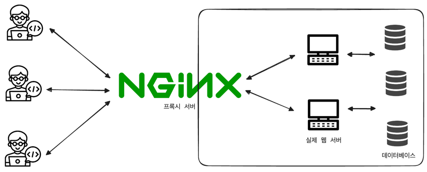
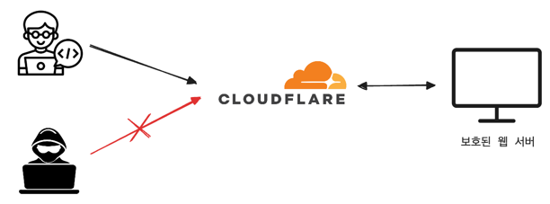

## 프록시 패턴

어떤 객체에 접근하기 위해 대리인 객체를 사용하는 패턴으로 원래 객체의 인터페이스를 그대로 구현하면서, 추가적인 기능을 제공할 수 있다. 
- 대상 객체에 접근하기 전 그 접근에 대한 흐름을 가로채 대상 객체 앞단의 인터페이스 역할을 한다.

**프록시 패턴 장점**
- 지연 초기화(Lazy Initialization): 실제 객체의 생성 비용이 큰 경우, 필요한 시점에 객체를 생성하여 자원을 절약할 수 있다. 
- 접근 제어(Access Control): 특정 객체에 대한 접근 권한을 제어할 수 있다. 
- 로깅(Logging), 감사(Auditing), 캐싱(Caching): 원래 객체에 대한 접근을 모니터링하거나 요청을 캐싱할 수 있다.

**프록시 패턴의 종류**
- 가상 프록시(Virtual Proxy): 객체의 생성 비용이 큰 경우, 실제 객체의 생성 및 초기화를 지연시킨다. 
- 원격 프록시(Remote Proxy): 다른 주소 공간에 있는 객체를 로컬에서 접근할 수 있도록 한다. 
- 보호 프록시(Protection Proxy): 객체에 대한 접근 권한 관리 
- 스마트 프록시(Smart Proxy): 로깅, 참조 카운팅, 접근 기록 등을 관리

```java
// Subject interface
interface Image {
    void display();
}

// RealSubject class
class RealImage implements Image {
    private String fileName;

    public RealImage(String fileName) {
        this.fileName = fileName;
        loadFromDisk(fileName);
    }

    private void loadFromDisk(String fileName) {
        System.out.println("Loading " + fileName);
    }

    @Override
    public void display() {
        System.out.println("Displaying " + fileName);
    }
}

// Proxy class: 실제 이미지 객체에 대한 참조를 보유하고 있으며, 처음 display() 메소드가 호출될 때 실제 이미지를 로드
// 두번째 호출부턴 캐시된 이미지 사용
class ProxyImage implements Image {
    private RealImage realImage;
    private String fileName;

    public ProxyImage(String fileName) {
        this.fileName = fileName;
    }

    @Override
    public void display() {
        if (realImage == null) {
            realImage = new RealImage(fileName);
        }
        realImage.display();
    }
}

// Client code
public class ProxyPatternDemo {
    public static void main(String[] args) {
        Image image = new ProxyImage("test_10mb.jpg");

        // Image will be loaded from disk
        image.display();
        System.out.println("");

        // Image will not be loaded from disk -> 캐시 사용
        image.display();
    }
}
```

---

### 프록시 서버
클라이언트와 실제 서버 간의 중개 역할을 하는 서버로 클라이언트가 프록시 서버를 통해 네트워크 서비스에 간접적으로 접속할 수 있도록 한다. 

**프록시 서버 - nginx**
nginx는 비동기 이벤트 기반의 구조와 다수의 연결을 효과적으로 처리 가능한 웹서버이다.
- Node.js 서버 앞단의 프록시 서버로 활용
- 앞단에 nginx를 프록시 서버로 두기 때문에 실제 포트를 숨길 수 있다.
- 정적 자원을 gzip으로 압축하는 등 다양한 작업을 앞단에서 처리 가능




**프록시 서버 - CloudFlare**
Cloudflare는 웹 보안, 콘텐츠 전송 네트워크(CDN), DDoS 방어, 인터넷 도메인 이름 서비스(DNS), HTTPS 구축 등의 서비스를 제공하는 글로벌 네트워크이다.
- 웹사이트와 애플리케이션을 더 빠르고, 안전하게 만드는 것을 목표로 한다.

> CDN? Content Delivery Network. 각 사용자가 인터넷에 접속하는 곳과 가까운 곳에서 콘텐츠를 캐시 ㅇ또는 배포하는 서버 네트워크로 사용자가 웹 서버로부터 콘텐츠를 다운로드하는 시간을 줄일 수 있다. 



- DDOS 공격 방어
  - 대규모 트래픽 공격으로부터 웹사이트를 보호
  - 의심스러운 트래픽, 시스템을 통해 오는 트래픽 자동 차단 
- HTTPS 구축
  - 보통 서버에서 HTTPS를 구축할 때 인증서를 기반으로 구축하는데 CloudFlare를 사용하면 별도의 인증서 없이 쉽게 HTTPS를 구축할 수 있다. 

---

### CORS와 프론트엔드의 프록시 서버

CORS(Cross-Origin Resource Sharing)는 서버가 웹 브라우저에서 리소스를 로드할 때 다른 오리진을 통해 로드하지 못하게 하는 HTTP 헤더 기반 메커니즘이다.
- 오리진: 프로토콜과 호스트 이름, 포트의 조합
  - ex) `https://gitudy.com:16880/home` 의 오리진은 `https://gitudy.com:16880`

> 프론트와 백엔드가 통신할 때 CORS 에러를 마주치는데 이를 해결하기 위해 프론트에서 프록시 서버를 만들기도 한다.

**CORS 에러 예시**
- 백엔드: 127.0.0.1:8080
- 프론트: 127.0.0.1:3000

이 때 프록시 서버를 둬 프론트에 요청되는 오리진을 127.0.0.1:8080으로 변경하는 것
