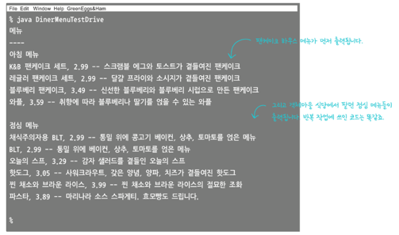

## 이터레이터 패턴
내부 구현 방법을 외부로 노출하지 않으면서 Iterator를 사용해 Collection 있는 모든 항목에 접근하는 패턴이다.
- `Iterator` 인터페이스에 의존하며 해당 인터페이스 하나로 여러 가지 자료형 구조와 상관없이 순회가 가능하다.


---

**`Iterator` 사용 예시**
```java
ArrayList<String> cities = new ArrayList<>();
cities.add("Seoul");
cities.add("Tokyo");
cities.add("Washington, D.C.");

// 방법 1
Iterator<String> iter = cities.iterator();
while (iter.hasNext()) {
		String s = iter.next();
		System.out.println(s);
}

// 방법 2
for (Iterator<String> iter = cities.iterator(); iter.hasNext(); ) {
		String s = iter.next();
		System.out.println(s);
}

// 방법 3
for (String city : cities) { // foreach
		System.out.println(city);
}
```

**컬렉션의 요소들을 삭제할 때 `Iterator` 활용**
```java
List<String> list = new ArrayList<>(Arrays.asList("a","b","c","d"));

// 인덱스를 사용해 리스트에서 요소를 제거하기
// 문제점: 요소가 제거되면서 리스트의 크기가 줄어들고 남은 요소들의 인덱스가 변경돼서 문제 발생
for (int i = 0; i < list.size(); i++) {
		list.remove(i); // when element is deleted, the list size
		// decreases and the indexes of other elements change
}

// for-each 루프를 사용해 제거하기
// 문제점: for-each 루프 내에서 반복하는 동안엔 리스트의 구조를 수정하는 것은 불허
for (String s : list) {
		list.remove(s); // ConcurrentModificationException
}

// Iterator를 사용해 안전하게 요소 제거
Iterator<String> it = list.iterator();
while (it.hasNext()) {
		String s = it.next(); // next() must be called before remove()
		it.remove();
}
```

---

### 이터레이터 패턴을 적용 예제
- ArrayList를 사용하는 팬케이크집 메뉴판
- 배열을 사용하는 디너 메뉴판

**두 메뉴를 프린트하고 싶을 경우**
- 둘의 getter가 반환하는 값이 다르므로 순환문을 2개 구현해야 한다.
```java
PancakeHouseMenu p = new PancakeHouseMenu();
ArrayList<MenuItem> plist = p.getMenuItems();

DinerMenu d = new DinerMunu();
MenuItem[] dlist = ds.getMenuItems();

plist.forEach(System.out::println);

for(int i=0; i<dlist.length; i++) { ... }
```

**이터레이터 패턴 적용**
```java
public interface Iterator {
	boolean hasNext();
	MenuItem next();
}

public class DinerMenuIterator implements Iterator {
    MenuItem[] items;
    int position = 0;

    public DinerMenuIterator(MenuItem[] items) {
        this.items = items;
    }

    public MenuItem next() {
        return items[position++];
    }

    public boolean hasNext() {
        return items.length > position;
    }
}
```

**DinnerMenu 클래스에서 Iterator 사용**
- 이전의 getMenuItems() 코드는 필요 없어졌으므로 삭제
```java
	// DinerMenuIterator 리턴
	public Iterator createIterator() {
                // Iterator 인터페이스를 리턴
		return new DinerMenuIterator(menuItems);
	}
```

**이터레이터를 사용해 메뉴판 출력하기**
- 이제 순환문이 하나만 있어도 된다
```java
public class Waitress {
	Menu pancakeHouseMenu;
	Menu dinerMenu;
 
	public Waitress(Menu pancakeHouseMenu, Menu dinerMenu) {
		this.pancakeHouseMenu = pancakeHouseMenu;
		this.dinerMenu = dinerMenu;
	}
 
	public void printMenu() {
		// 2개의 Iterator 생성
		Iterator pancakeIterator = pancakeHouseMenu.createIterator();
		Iterator dinerIterator = dinerMenu.createIterator();

		System.out.println("MENU\n----\nBREAKFAST");
		printMenu(pancakeIterator);
		System.out.println("\nLUNCH");
		printMenu(dinerIterator);

	}
 
	private void printMenu(Iterator iterator) {
		while (iterator.hasNext()) {
			MenuItem menuItem = iterator.next();
			System.out.print(menuItem.getName() + ", ");
			System.out.print(menuItem.getPrice() + " -- ");
			System.out.println(menuItem.getDescription());
		}
	}
}
```


---
