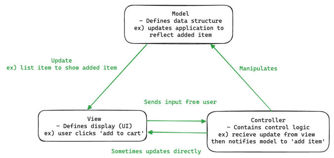
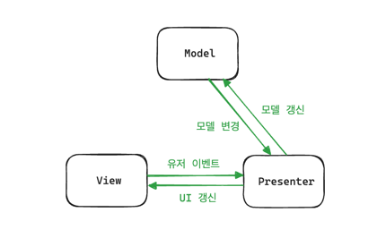
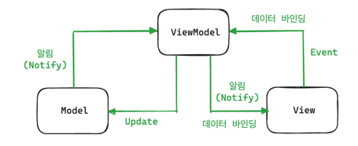

## MVC 패턴

---

애플리케이션의 구성 요소를 3가지 역할 Model, View, Controller로 구분해 각 구성 요소에 집중할 수 있도록 하는 패턴이다.

**MVC 패턴의 특징**
- 재사용성과 확장성 용이
- but, 애플리케이션이 복잡해질수록 모델과 뷰의 관계가 복잡해짐

---

### Model
- 애플리케이션의 데이터 (데이터베이스, 상수, 변수 등)
- 비즈니스 로직

### View
- 레이아웃과 화면 처리
- 사용자 인터페이스 요소
- 모델을 기반으로 사용자가 볼 수 있는 화면

### Controller
- 하나 이상의 모델과 하나 이상의 뷰를 잇는 다리 역할을 하며 이벤트 등 메인 로직 담당
- 모델과 뷰의 생명주기 관리(명령 전달)

---

### MVC 패턴 예시
- 쇼핑 리스트 앱
- 목표: 이번 주에 사야할 각 항목의 이름, 개수, 가격의 목록

- 모델: 리스트 항목이 포함해야 하는 데이터(품목, 가격 등)과 이미 존재하는 리스트 항목이 무엇인지 지정
- 뷰: 모델로부터 받은 리스트 항목이 사용자에게 보여지는 방식 정의
- 컨트롤러: 사용자의 입력에 대한 응답으로 모델 및 뷰를 업데이트

ex) 쇼핑 리스트 앱은 항목을 추가하거나 제거할 수 있게 해주는 입력 폼과 버튼이 있다. 이 액션들은 모델이 업데이트되는 것이므로 먼저 입력이 컨트롤러에게 전송되고 모델을 적당하게 처리한 다음 업데이트된 데이터를 뷰로 전송한다.

---

### MCV 패턴 라이브러리 React.js
유저 인터페이스를 구축하기 위한 라이브러리로 가상 DOM을 통해 실제 DOM을 조작하는 것을 추상화해 성능을 높인다.

**리액트 특징**

- state는 setState로만 수정 가능 - 불변성
- props를 기반으로 만들어지는 pureComponent
- 단방향 바인딩 적용
- 자유도 높음 
- 여러 대기업에서 사용중

---

## MVP 패턴
MVC의 C에 해당하는 컨트롤러가 프레젠터(Presenter)로 교체된 패턴으로 뷰와 프레젠터가 일대일 관계이기 때문에 MVC 패턴보다 더 강한 결합을 가지고 있다.

---

## MVVM 패턴
MVC의 C에 해당하는 컨트롤러가 뷰모델(view model)로 교체된 패턴이다. 뷰모델은 뷰를 더 추상화한 계층이며 MVC 패턴과 다르게 커맨드와 데이터 바인딩을 가진다.

1. 사용자 Action이 View를 통해 들어옴
2. View에 Action이 들어오면 ViewModel에 Action 전달
3. ViewModel은 Model에 데이터 요청
4. Model은 요청받은 데이터를 ViewModel에 응답
5. ViewModel은 응답받은 데이터를 가공하고 저장
6. View는 Data Binding을 통해 UI 갱신

MVP는 View와 Presenter 사이의 의존관계가 1:1이었다면 MVVM은 View와 ViewModel 사이 관계가 1:N이다. 또한 데이터 바인딩을 통해 View와 ViewModel 사이의 의존성을 없앨 수 있다.

**MVVM 장점**

- 뷰 로직과 비즈니스 로직 분리 가능 (UI가 나오지 않아도 개발 가능)
- 의존성이 없어지기 때문에 테스트 용이
- 1:N 관계이기 때문에 UI를 별도의 코드 수정 없이 재사용할 수 있다.
- 많은 기업에서 사용중

**MVVM 단점**

- 설계하기 어려움
- 뷰 모델이 무거워질 수 있음
- 데이터 바인딩으로 인한 메모리 소모
