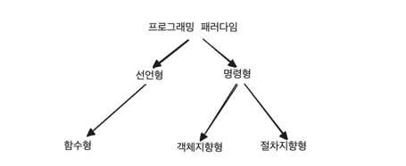
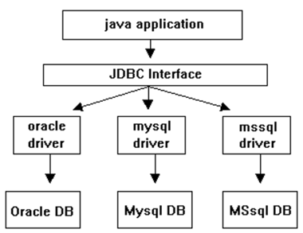
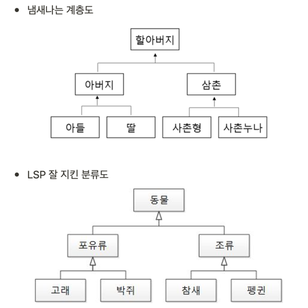
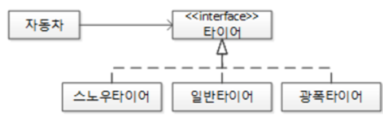

## 프로그래밍 패러다임



---

### 선언형(declarative)과 함수형(functional) 프로그래밍
- 선언형 프로그래밍: '무엇을' 풀어내는가에 집중하는 패러다임
- 함수형 프로그래밍: 선언형 패러다임의 일종

### 함수형 프로그래밍
'순수 함수'들을 블록처럼 쌓아 로직을 구현하고 '고차 함수'를 통해 재사용성을 높인 프로그래밍 패러다임이다.
- 자바 스크립트의 경우 함수가 일급 객체이기 때문에 객체지향 프로그래밍보다는 함수형 프로그래밍 방식이 선호된다.

### 순수 함수
- 출력이 입력에만 의존하는 것을 의미

### 고차 함수
- 함수가 함수를 값처럼 매개변수로 받아 로직을 생성할 수 있는 것
- 고차 함수를 쓰기 위해서는 해당 언어가 일급 객체어야 한다.

**일급 객체**
- 변수나 메서드에 함수 할당 가능
- 함수 안에 함수를 매개변수로 담기 가능
- 함수가 함수 반환 가능

---

### 객체지향 프로그래밍 (OOP, Object-Oriented Programming)
- 객체들의 집합으로 프로그램의 상호 작용 표현
- 데이터를 객체로 취급해 객체 내부에 선언된 메서드를 활용
  - 컴포넌트화 → 재사용성 증가
- 어렵고 느리다.

**OOP 특징**
- Object
    - 객체는 상태와 동작을 가진다.
- Class
    - 데이터와 코드를 해당 obejct 타입으로 그룹화
    - 객체의 “타입” 정의
    - ex) Car
- Instance
    - ex) carA, carB
- Abstraction
    - 기능만 유저에게 제공하고 기능의 내부 구현은 추상화로 숨김
    - 코드 반복 줄임
    - 추상 클래스와 interface의 차이
        - 전부다 추상화되어 있는 상태이면 interface 사용
        - 그 외 데이터가 필요한 경우 abstract 클래스 사용
- Encapsulation
    - 필드에 직접 접근하지 못하도록 private로 정보 은닉
        - getter, setter 메서드 사용해 접근
    - 인터페이스와 분리
- Inheritance(상속)
    - 상속받았다는 것은 받기 싫다고 안 받는 게 아니라 무조건 받는 것
    - 멀티 상속 불가능
        - 대신 다중 인터페이스 구현은 가능
- **Polymorphism(다형성)**
    - 인터페이스는 같은데 데이터 타입에 따라 다르게 작동
    - ex) 운다는 인터페이스는 같지만 객체 쥐, 고양이에 따라 다르게 작동
    - 오버라이딩 vs 오버로딩

## 오버라이딩 (overriding)

- 상속받은 조상의 메서드를 자신에 맞게 변경하는 것(재정의)
- 런타임 중 발생하는 '동적' 다형성

```java
class point {
    int x;
    int y;

    String getLocation() {
        return x + "," + y;
    }
}

class point3D extends Point {
    int z;

    // 오버라이딩 - 선언부 변경 불가능, 내용(구현)만 변경 가능
    String getLocation() { 
        return x + "," + y + "," + z;
    }
}
```

## 오버라이딩의 조건

1. 선언부가 조상 클래스의 메서드와 일치해야 한다.
2. 접근 제어자를 조상 클래스의 메서드보다 좁은 범위로 변경할 수 없다.
3. 예외는 조상 클래스의 메서드보다 많이 선언할 수 없다.

    ```java
    class Parent {
        // 부모 클래스에 2개의 예외
        void t() throws IOException, SQLException { }
    }
    
    class Child extends Parent {
        // 자식 클래스 예외 2개까지만 가능
        void t() { }
    }
    ```


## 오버로딩 vs 오버라이딩

- 오버로딩
  - 기존에 없고 이름이 같은 새로운 메서드를 정의하는 것 (new)
  - 이름이 같지만 메서드의 타입, 매개변수의 유형, 개수 등이 다른 메서드 여러 개 가능
  - 컴파일 중 발생하는 '정적' 다형성
  - 오버로딩이 성립하기 위한 조건
      1. 메서드 이름이 같아야 한다.
      2. 매개변수의 개수 또는 타입이 달라야 한다.
      3. 반환 타입은 영향 없다.
- 오버라이딩 : 상속받은 메서드의 내용을 변경하는 것 (change, modify)

```java
class Parent {
    void t() { }
}

class Child extends Parent {
    void t() { }       // 오버라이딩
    void t(int i) { }  // 오버로딩

    void t2() { }      // 메서드 정의
    void t2() { }      // 오버로딩
    void t2() { }      // 중복 정의 -> 에러
}
```

---

### 설계 원칙

### SRP(Single Responsibility Principle) - 단일 책임 원칙
- 모든 클래스가 각각 하나의 책임을 가지도록 역할을 분리하는 것
- 애플리케이션의 경계를 정하고 추상화를 통해 클래스를 선별하고 속성과 메서드를 설계할 때 반드시 SRP 원칙을 고려해야 한다.

**냄새나는 코드**
```java
public class 강아지 {
    final static Boolean 수컷= true;
    final static Boolean 암컷= false;
    Boolean 성별;

    void 소변() {
        if (this.성별 ==수컷) {
            System.out.println("서서");
        } else {
            System.out.println("앉아서");
        }
    }
}
```
수컷이냐 암컷이냐에 따라 소변보다() 메서드에서 분기 처리가 진행된다. 강아지 클래스가 수컷, 암컷 모두를 구현하려고 하기에 SRP를 위반하는 것이다.
- SRP를 어기는 대표적인 부분이 if 문으로 분기처리가 되는 부분이다.

**리팩토링**
```java
abstract class 강아지 {
    abstract void 소변();
}

class 수컷강아지 extends 강아지 {
    void 소변() {
        System.out.println("서서");
    }
}

class 암컷강아지 extends 강아지 {
    void 소변() {
        System.out.println("앉아서");
    }
}
```

---

### OCP(Open-Closed Principal) - 개방 폐쇄 원칙
- 자신의 확장에는 열려있고, 주변의 변화에 대해서는 닫혀 있어야 한다.
- 기존의 코드는 잘 변경하지 않으면서도 확장은 쉽게 할 수 있어야 한다.
- 자동차를 마티즈에서 쏘나타로 바꾼다고 하더라도 운전에 영향을 받지 않아야 한다. 다양한 자동차가 생긴하고 해도 객체 지향의 세계에서는 영향을 받으면 안된다. 즉, 자동차 입장에서는 다양한 자동차가 생기기에 자신의 확장에는 개방된 것이고, 운전자 입장에서는 자동차가 바뀌어도 운전법은 그대로이므로 주변의 변화에 닫혀있는 것이다. 

**OCP의 좋은 예제 - DB 프로그래밍 JDBC**

- 오라클을 MySQL로 교체할 때 (Open) 자바 애플리케이션은 JDBC 인터페이스라고 하는 완충 장치로 인해 변화에 영향을 받지 않는다. (Closed)

**OCP의 예제 - 자바**
- 개발자는 소스코드를 윈도우, 리눅스 등 구동될 운영체제는 고민하지 않고 개발한다. (Closed)
- 각 운영체제 별 JVM과 목적 파일(.class)가 있기 때문 (Open)

---

### LSP(Liskov Substitution principle) - 리스코프 치환 원칙
- 객체는 프로그램의 정확성을 깨뜨리지 않으면서 하위 타입의 인스턴스로 바꿀 수 있어야 한다.
- 클래스는 상속이 되면 부모, 자식 계층 관계가 생성되는데 이때 부모 객체에 자식 객체를 넣어도 시스템에 문제가 생기면 안된다.
- 객체 지향의 상속 특성을 잘 활용하면 알아서 잘 지켜질 것이다.


---

### ISP(Interface Segregation Principle) - 인터페이스 분리 원칙
- 하나의 일반적인 인터페이스보다 구체적인 여러 개의 인터페이스를 만들어야 하는 원칙

> “클라이언트는 자신이 사용하지 않는 메서드에 의존 관계를 맺으면 안 된다.” - 로버트 C.마틴

**남자 클래스**

- 남자친구 역할 클래스
- 아들 역할 클래스
- 소대원 역할 클래스
- 사원 역할 클래스

SRP 원칙을 적용하기 위해 남자 클래스를 각 역할로 구분했다. 하나의 역할만 하는 다수의 클래스로 분할한 것이다.

다르게 리팩터링하는 방법으로 ISP가 있다.

**남자 클래스**

- 남자친구 인터페이스
- 아들 인터페이스
- 소대원 인터페이스
- 사원 인터페이스

남자 클래스를 분리하는 것이 아닌 인터페이스로 역할을 제한하는 것이다.

- 어머니와 있을 땐 아들 인터페이스로 제한

결론적으로 SRP와 ISP는 같은 문제에 대한 다른 두가지 해결책이지만 특별한 경우가 아니라면 SRP가 더 좋은 해결책이다.

---

### DIP(Dependency Inversion Principle) - 의존 역전 원칙
- 자신보다 변하기 쉬운 것에 의존하던 것을 추상화된 인터페이스나 상위 클래스를 두어 변하기 쉬운 것의 변화에 영향받지 않게 하는 원칙

자동차의 타이어를 겨울에는 스노우 타이어 평상시엔 일반 타이어로 교체해야 할 경우 DIP 원칙을 적용해 구체적인 타이어들을 추상화된 타이어 인터페이스에 의존하도록 설계한다.


기존에는 자동차가 자신보다 변하기 쉬운 스노우 타이어에 의존했다. DIP 원칙을 적용하면서 추상적인 타이어 인터페이스에 구체적인 타이어들이 의존하게 됐다. 의존의 방향이 역전된 것이다. 그래서 의존 역전 원칙 DIP라고 불린다.
- 자신보다 변하기 쉬운 것에 의존하던 것을 추상화된 인터페이스나 상위 클래스를 두어 변하기 쉬운 것의 변화에 영향을 받지 않게 한다.

> “고차원 모듈은 저차원 모듈에 의존하면 안된다. 이 두 모듈 모두 다른 추상화된 것에 의존해야 한다.” - 로버트 C.마틴

> “추상화 된 것은 구체적인 것에 의존하면 안 된다. 구체적인 것이 추상화된 것에 의존해야 한다.” - 로버트 C.마틴

> “자주 변경되는 구체 클래스에 의존하지 마라” - 로버트 C.마틴

인간보다는 신을, 아이보다는 어른을, 부하 직원보다는 상사에게 의존하는 것을 생각하자. 변하기 쉬운 것에 의존하지 말고 변할 가능성이 적은 것에 의존하자!

---

## SoC(Separation Of Concerns) - 관심사의 분리

- 관심이 같은 것끼리는 하나의 객체 안으로 또는 친한 객체로 모으고, 관심이 다른 것은 가능한 따로 떨어져 서로 영향을 주지 않도록 분리하는 원칙
- 하나의 속성, 메서드, 클래스 모듈, 패키지에는 하나의 관심사만 존재해야 한다.
- SoC를 적용하면 자연스럽게 SRP, ISP, OCP에 도달한다.