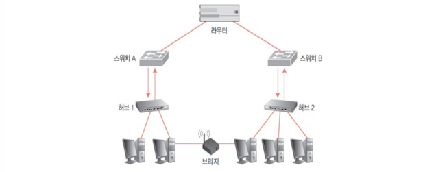
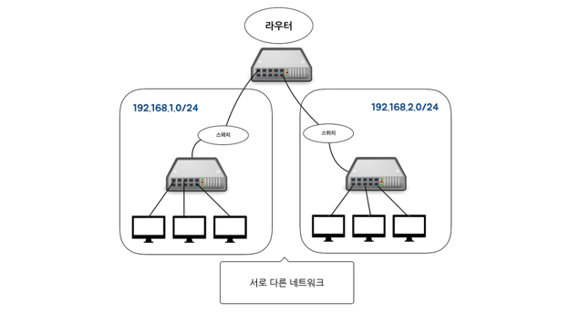
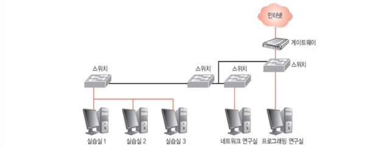
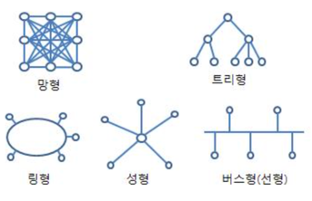
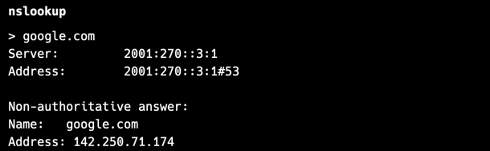

## 네트워크의 기초
- 네트워크 = node + link
  - node: 서버, 라우터, 스위치 등 네트워크 장비
  - link: 유무선 연결 장치

 

---

### 네트워크 접속 장치

- 컴퓨터나 네트워크 장치는 NIC를 사용해 네트워크 연결
    - NIC(Network Interface Card): 컴퓨터가 네트워크에 연결되어 통신할 수 있도록 하는 하드웨어 장치
- 허브, 중계기, 스위치, 라우터, 게이트웨이 등을 사용해 다양한 네트워킹 문제 해결

**브리지**

- 물리적으로 분리된 네트워크가 통신할 수 있게 해줌
- 무선 네트워크 장비

**허브**

- 네트워크에 연결된 다양한 장치들을 연결하는 장비
- 요즘은 잘 안 씀
- 데이터를 받으면 해당 데이터를 연결된 모든 장치에 브로드캐스트
- 작은 규모의 네트워크나 간단한 테스트 환경에서 사용

**중계기**

- 네트워크에서 데이터의 신호를 증폭해 전달
- 주로 WAN에서 장거리 통신을 위해 사용

 

---

### 네트워크 구성

**스위치**

- 데이터 링크 계층 장비 (OSI 기준) (L2~3)
    - 네트워크 장치 간의 데이터 전송을 관리하고 제어하는 장비
    - 요즘 쓰는 것
- MAC (물리주소, 랜카드 하드웨어) 주소를 이용
    - MAC 주소를 이용하다보니 IP주소는 다른데 같은 MAC을 사용해 통신 가능
- 각각의 랜카드마다 고유의 주소가 있어서 그 주소를 기반으로 머신과 머신 간 통신 (Point-to-point)
- 스위치는 목적지 장치에만 데이터를 전송하므로 허브보다 효율적이고 성능이 우수
- 주로 LAN에서 사용되고 개별적인 연결을 제공해 충돌을 방지해 대역폭을 효율적으로 사용

**라우터**

- 서로 다른 네트워크 간에 통신하는 데 사용하는 장치
- IP주소를 바탕으로 데이터가 수신지까지 갈 수 있는 경로를 검사, 효율적으로 경로를 선택하는 라우팅 기능 수행
- 오류 패킷 폐기, 혼잡 제어 등의 기능도 수행
- 네트워크에서 다른 지역의 컴퓨터와 통신할 때 어느 통신사의 망을 사용할지 결정하는 것은 라우터의 라우팅 프로토콜에 의해 이뤄진다.
    - 라우팅 프로토콜은 네트워크에서 데이터 패킷이 목적지로 전송되는 경로를 결정하는 규칙들의 집합

**게이트웨이**

- 다른 두 개 이상의 네트워크를 상호 접속하여 정보를 주고 받을 수 있게 해주는 장치
- ex) 로컬 네트워크와 인터넷 간의 통신을 가능하게 하는 인터넷 게이트웨이
- Net2와 Net1 계층을 연결하는 중앙의 연결점
    - 게이트 웨이 위쪽 인터넷 부분이 Net2, 아래쪽 스위치와 컴퓨터는 Net1
- 가상화 기술이 발전함에 따라 많은 네트워크 기능들이 가상 머신(VM)으로 구현되는데 이 때 게이트웨이 개념이 중요하다.
    - 가상화된 환경에서 게이트웨이를 운용하기 위해서는 최소 두 개의 네트워크 인터페이스가 필요하므로 최소 2개의 가상화가 필요해지는 것이다.

 

---

### 처치량과 지연 시간

**좋은 네트워크의 기준**
- 많은 처리량(throughput)
  - link를 통해 전달되는 단위 시간당 데이터양
  - 단위: bps(bits per second)
  - throughput 영향 요인: 트래픽, 네트워크 장치 간 대역폭, 에러, 하드웨어 스펙 등
- 짧은 지연 시간(latency)
  - 요청이 처리되는 시간으로 메세지가 두 장치 사이를 왕복하는 데 걸린 시간
  - latency 영향 요인: 매체 타입(유선, 무선), 패킷 크기, 라우터의 패킷 처리 시간

  

---

### 네트워크 토폴로지와 병목 현상

- 트리 포폴로지
  - 계층형 토폴로지로 노드의 추가, 삭제 간편
  - 상위 노드에 트래픽이 집중되면 하위 노드에 영향
- 버스 토폴로지
  - 모든 장치가 단일 중앙 케이블(버스)에 연결된 구조 
  - 설치 비용이 적고 신뢰성 우수
  - 하나만 이상해도 큰 장애 발생 가능성
  - 스푸핑 가능성
    - LAN상에서 모든 장치가 하나의 케이블을 공유하므로, 스위칭 기능을 마비시키거나 데이터를 가로채 변조할 가능성이 있다.
- 스타 토폴로지(성형 토폴로지)
  - 중앙 노드에 모든 노드가 연결된 구조
  - 에러 및 장애를 탐지하기 쉽고 패킷 충돌 발생 가능성이 작다.
  - 중앙 노드에 장애 발생 시 전체 네트워크가 마비
  - 높은 설치 비용
- 링형 토폴로지
  - 양 옆의 두 노드와 연결해 전체적으로 고리 형태로 연속된 길을 통해 통신하는 구조
  - 데이터 손실이 거의 없고 충돌 가능성도 적다.
  - 네트워크 구성 변경이 어렵고 장애 발생 시 전체 네트워크에 영향
  - 잘 사용 안 할 것 같지만 주로 무선 통신에서 사용
    - 드론 네트워크: 트론들을 링처럼 타고 타서 통신
    - ad-hoc Network: 네트워크에 참여하는 각 장치가 직접 서로 연결되는 임시 네트워크로 하나씩 붙여서 확장하는 형태
- 메시 토폴로지(망형/그물형 토폴로지)
  - 노드들이 각각 연결되어 있는 형태
  - 하나가 죽어도 여러 개의 경로가 존재해 통신이 가능하지만 오버헤드 커질 수 있음
  - 노드의 추가가 어렵고 비용이 높음

 

**병목(bottleneck) 현상**
- 전체 시스템의 성능이나 용량이 하나의 구성 요소로 인해 제한 받는 현상
  - ex) 서비스에서 이벤트를 열었는데 예상보다 트래픽이 많이 생겨서 웹 사이트 마비 
- 병목 현상의 기준: 네트워크 구조(토폴로지)

**토폴로지별 병목 현상 해결 방안**
- 스타 토폴로지
  - 중앙 연결 장치 (허브, 스위치 등)에 병목 현상
  - 중앙 연결 장치 업그레이드
  - 부분적으로 분산형 구조로 변경해 트래픽 분산
  - 중앙 장치에서 각 장치로 연결되는 추가 회선 설치
- 링형 토폴로지
  - 특정 구간 또는 장치에서 병목 현상
  - 이중 링 토폴로지를 도입해 대체 경로 제공
- 버스 토폴로지
  - 더 높은 대역폭을 제공하는 중앙 케이블로 교체
  - 여러 하위 네트워크로 분할
- 메시 토폴로지
  - 라우팅 프로토콜을 최적화해 데이터 전송 경로를 효율적으로 설정
- 트리 토폴로지
  - 상위 계층 노드에서 병목 현상
  - 상위 노드와 하위 노드 간의 연결 회선을 추가해 데이터 전송 용량 증가

 

---

### 네트워크 분류
규모를 기반으로 네트워크 분류
- LAN (Local Area Network)
  - 근거리 통신망(같은 건물, 같은 동네)
  - 전송 속도가 빠르고 혼잡하지 않음
- MAN (Metropolitan Area Network)
  - 대도시 지역 네트워크
  - 전송 속도 쏘쏘, 약간 혼잡
- WAN (Wide Area Network)
  - 광역 네트워크 (국가 또는 대륙)
  - 전송 속도 낮고 혼잡

 

---

### 네트워크 성능 분석 명령어

**네트워크 병목 현상 요인**
- 네트워크 대역폭
- 네트워크 토폴로지
- 서버 CPU, 메모리 사용량
- 비효율적인 네트워크 구성

**`ping`: Packet INternet Groper**
- 특정 네트워크 주소(IP 주소 또는 도메인 이름)로 패킷을 보내고 응답 시간을 측정하여 네트워크 연결 상태를 확인
- TCP/IP 프로토콜 중 ICMP 프로토콜(Internet Control Message Protocol, 인터넷 제어 메시지 프로토콜)을 통해 동작
  - 네트워크 연결 상태와 관련된 정보 교환을 위해 사용하는 프로토콜
  - 연결 상태를 유지하지 않고 메세지 교환

**`netstat`**
- 네트워크 연결, 라우팅 테이블, 네트워크 인터페이스 통계 등을 확인

**`nslookup`**

- 도메인 이름 시스템(DNS) 조회를 수행해 도메인 이름에 해당하는 IP 주소를 찾거나, IP 주소에 해당하는 도메인 이름을 찾는 데 사용

**`traceroute`**
- 특정 목적지로 가는 경로를 추적하여 네트워크 경로에 있는 각 홉(네트워크 장치)까지의 응답 시간을 측정하는 데 사용
- 데이터 패킷이 목적지에 도달하기까지 거치는 경로와 각 경로의 지연 시간을 알 수 있다.

 

---

### 네트워크 통신 방식

**Unicast**
- 특정 수신자에게 데이터 패킷을 직접 전송하는 1:1 통신 방식
- 송신자와 수신자가 명확하게 정의되어 있으며, 주로 MAC 주소나 IP 주소를 사용하여 특정 대상과 통신
- 데이터가 필요한 대상에게만 전송되기 때문에 불필요한 트래픽을 줄일 수 있어서 네으퉈크 리소스를 효율적으로 사용할 수 있다.

**Broadcast**
- 로컬 LAN (Local Area Network) 내의 모든 장치에 데이터를 전송하는 방식
- 특별한 주소(ex: 이더넷의 경우 MAC 주소가 `FF-FF-FF-FF-FF-FF`인 브로드캐스트 주소)를 사용하여 LAN 내의 모든 장치에 데이터를 동시에 전송
- 네트워크 초기 설정에서 장치를 구성하거나 네트워크에 있는 모든 장치에 특정 정보를 알릴 필요가 있을 때 사용
- DHCP(Dynamic Host Configuration Protocol)  서버가 IP 주소를 할당할 때 브로드캐스트를 사용
  - 네트워크에 연결된 장치가 자동으로 IP 주소 및 기타 네트워크 구성을 받을 수 있게 해주는 통신 프로토콜
  - 사용자가 네트워크 설정 걱정 없이 쉽게 네트워크 연결 가능
  - 대규모 네트워크 환경에서 효율적으로 IP 주소 관리
- 인터럽트 처리
  - 네트워크의 브로드캐스트 트래픽이 많아 통신 속도가 느려질 수 있다. 
  - 브로드캐스트 트래픽이 많으면 네트워크의 오버헤드가 증가하고 전체적인 응답 시간이 길어지게 됨

 

---

### 네트워크 프로토콜 표준화
네트워크 프로토콜 표준화는 다양한 제조업체가 만든 장치들이 상호 호환성을 유지하면서 원활하게 통신할 수 있도록 공통된 규칙과 인터페이스를 정의하는 것이다.
- IEEE 또는 IETF 표준화 단체가 지정
- IEEE 802.3 (이더넷): 유선 LAN 프로토콜
- IEEE 802.11 (Wi-Fi): 무선 LAN 프로토콜 
- HTTP(Hypertext Transfer Protocol): 웹 접속 시 사용하는 프로토콜
- TCP/IP: 인터넷과 대부분의 네트워크에서 사용되는 기본 프로토콜로 TCP는 신뢰성 있는 연결을 제공하고 IP는 데이터 패킷의 라우팅을 담당
- SMTP(Simple Mail Transfer Protocol): 이메일 전송을 위한 프로토콜
- FTP(File Transfer Protocol): 파일 전송을 위한 프로토콜
- ...

**계층별 프토토콜**
- 이더넷
  - LAN 유선 네트워크
  - 프레임에 데이터를 담아 전송
- IP/ARP/ICMP
  - IP: 데이터 패킷의 전달 담당
  - ARP: IP 주소를 네트워크 상에서 사용되는 물리적인 MAC 주소로 변환
  - ICMP: 네트워크 관리 및 에러 메세지 전달 담당 ex) ping
- TCP/UDP
  - TCP: 신뢰성 있는 데이터 전송을 보장하는 연결형 프로토콜
  - UDP: 신뢰성 없는 데이터 전송을 제공하는 비연결형 프로토콜
- DNS/DHCP
  - DNS: 호스트의 도메인 이름 ↔ IP 주소 간 변환
  - DHCP: 호스트가 네트워크에 연결될 때 자동으로 IP 주소를 받아올 수 있도록 함
  - 텔넷은 오래된 네트워크 장비에 접속할 때 사용
  - SMTP 메일 서버

 

---

**출처**
- http://www.ktword.co.kr/test/view/view.php?no=356
- https://yohanpro.com/posts/%EB%9D%BC%EC%9A%B0%ED%84%B0%EC%9D%98%20%EA%B5%AC%EC%A1%B0/
- 