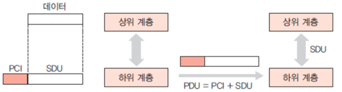

## TCP/IP 4계층 모델
TCP/IP 모델은 인터넷 프로토콜 스위트의 구현을 위한 모델로, 네트워크 통신을 위한 규칙과 절차를 정의한다.

### 기존 OSI 7계층과의 비교

**OSI 7계층**
- 데이터 전송 방식
  
  - 데이터가 상위 계층에서 하위 계층으로 전달될 때, 각 계층은 자신의 PCI를 SDU에 추가하여 PDU를 형성
  - PCI(Protocol Control Information) 프로토콜 제어 정보
    - 헤더 붙이기
  - SDU(Service Data Unit) 서비스 데이터 단위
  - PDU(Protocol Data Unit) 프로토콜 데이터 단위

| OSI Layer | PDU | 역할 |
| --- |---|---|
| Application (L7) | Data | 사용자와 통신 서비스 간의 상호 작용   HTTP, FTP, SMTP |
| Presentation (L6) | Data | 데이터 형식 변환, 데이터 암호화, 압축 등  MIME 인코딩, 암호화 |
| Session (L5) | Data | 통신 세션을 설정, 유지 및 해제하고 동기화|
| Transport (L4) | Segment | 종단(end-point) 간 통신을 제공  TCP, UDP  |
| Network (L3) | Packet | 라우팅과 패킷 전달을 담당  IP  |
| Data Link (L2) | Frame | 네트워크 상의 노드 간 데이터 전송을 관리하고 물리적인 주소 할당 및 에러 검출   이더넷, Wi-Fi |
| Physical (L1) | Bit | 실제 데이터 전송 매체  Ethernet의 MAC 주소 |

**TCP/IP 4계층 모델**

- TCP/IP 모델은 OSI 참조 모델의 7계층을 4계층으로 단순화한 모델

### **애플리케이션 계층**
- 웹 서비스, 이메일 등 실제로 사용자에게 제공할 서비스
 
### **전송 계층**
- 송신자와 수신자를 연결하는 통신 서비스 
- 연결 지향 데이터 스트림 지원
- 신뢰성, 흐름 제어 제공
- TCP : 
- UDP :
- 가상 회선 

**가상회선 패킷 교환 방식(VC, Virtual Circuit Packet Switching)**
각 패킷에 가상회선 식별자(VCI, Virtual Circuit Identifier)가 포함되며 모든 패킷을 설정된 경로에 따라 전송하면 가상회선이 해제되고 패킷들은 전송된 순서대로 도착하는 방식
- 순차적으로 전송한 데이터의 순서 보장

**데이터그램 패킷 교환 방식**
하나의 메세지에서 분할된 여러 패킷이 독립적으로 이동하며 최적의 경로를 선택해 전송
- 순서 보장 안됨
- 패킷이 손실되거나 손상될 수 있으므로 상위 계층(ex: TCP)에서 오류 검출 및 재전송 매커니즘을 사용해 데이터의 신뢰성 확보
- IP에서 기본적으로 사용되며 TCP/IP 스택의 중요한 부분

**TCP 연결 성립 과정 -> 3-way handshake**

3-way handshake 후 신뢰성이 구축되고 데이터 전송을 시작한다.

**TCP 연결 해제 과정 -> 4-way handshake**

여기서 굳이 왜 TIME_WAIT로 이정 시간 대기 후 CLOSED를 하는 이유
1. 지연 패킷이 발생했을 경우의 처리를 위해
2. 두 장치가 연결이 닫혔는지 확인하기 위해

 

---

### 인터넷 계층
장치로부터 받은 네트워크 패킷을 IP 주소로 지정된 목적지로 전송하는 계층
- IP, ARP, ICMP 등
- 패킷을 수신해야 할 상대의 주소를 지정해 전송
- 도착 보장이 없는 비연결형적 특성

 

---

### 링크(네트워크) 계층

유선, 무선 등으로 데이터를 전달하며 장치 간 신호를 주고받는 규칙을 정하는 계층
- 물리 계층: 무선 LAN과 유선 LAN을 통해 0과 1로 이루어진 데이터를 전송
- 데이터 링크 계층: 이더넷 프레임을 통해 에러 확인, 흐름 제어, 접근 제어 담당

---

**유선 LAN**
- 유선 LAN을 이루는 이더넷은 IEEE 802.3 프로토콜 준수
- 전이중화(full duplex) 통신 사용

**전이중화 통신**
  - 양쪽 장치가 동시에 송수신할 수 있는 방식
  - 송신로, 수신로로 나눠서 통신
  - 현대의 고속 이더넷의 통신 방식
  

**CSMA/CD**
- Casrrier Sense Multiple Access with Collision Detection
- 이전 유선 LAN이 사용하던 통신 방식으로 반이중화 통신 방법 중 하나
- 데이터를 보낸 이후 충돌이 발생하면 일정 시간 이후 재전송하는 방식
- 하나의 경로로 데이터를 송수신하기 때문에 충돌에 대비해야 했음

**유선 LAN을 이루는 케이블**
- 트위스트 페어 케이블 (TP 케이블)
  - 8개의 구리선을 2개씩 꼬아서 묶은 케이블
- 광섬유 케이블
  - 레이저를 이용해 통신하기 때문에 구리선보다 훨씬 빠르고 장거리 통신 가능

---

**무선 LAN의 반이중화 통신**
- 반이중화 통신은 양쪽에서 서로 통신할 수 있지만 동시에는 통신할 수 없다.
- 충돌 때문에 한 번에 한 방향 통신만 가능
- ex) CSMA/CA
  - 데이터를 보내기 전 캐리어 감지 등 사전에 가능한 충돌을 방지하는 방식 사용
  1. 데이터 송신 전 무선 매체 탐색
  2. 캐리어 감지: 회선이 비어있는지 확인
  3. IFS(Inter FrameSpace): 정해진 시간만큼 대기
  4. 이후에 데이터 송신

---

**무선 LAN을 이루는 주파수**
- 무선 LAN(Wireless Local Area Network)는 무선 신호 전달 방식을 이용해 2대 이상의 장치를 연결하는 기술
- 공기에 주파수를 쏴서 무선 통신망 구축
  - 주파수 대역: 2.4GHz(장애물에 강하지만 전파 간섭) or 5GHz(채널이 많고 동시 사용도 가능해서 보통은 더 좋음)

**와이파이**
- 전자기기들이 무선 LAN 신호에 연결할 수 있도록 하는 기술
- 무선 접속 장치(AP, Access Point) 필요 (ex: 공유기)
  - 유선 LAN에 흐르는 신호를 무선 LAN 신호로 변환해 신호 범위 내에서 무선 인터넷을 사용할 수 있도록 해줌

**BSS(Basic Service Set)**
- 동일 BBS 내에 있는 AP 장치들 통신
- 근거리 무선 통신 제공

**ESS(Extended Service Set)**
- 하나 이상의 연결된 BSS 그룹
- 장거리 무선 통신 제공
- 다른 장소로 이동해도 중단 없이 네트워크 연결 

---

**이더넷 프레임**
데이터 링크 계층은 이더넷 프레임을 통해 전달받은 데이터의 에러를 검출하고 캡슐화한다.

> MAC 주소: 장치에는 네트워크에 연결하기 위한 장치(LAN 카드)가 있는데 이를 구별하기 위한 식별 번호 6byte

 

---

### 계층 간 데이터 송수신 과정

**캡슐화 과정**
상위 계층의 헤더와 데이터를 하위 계층의 데이터 부분에 포함시키고 해당 계층의 헤더를 삽입하는 과정

**비캡슐화 과정**
하위 계층에서 상위 계층으로 가며 각 계층의 헤더 부분을 제거하는 과정

### PDU
계층 간 데이터 전송 시 한 덩어리의 단위를 PDU(Protocol Data Unit)이라고 한다. PDU에는 제어 관련 정보들이 포함된 헤더와 데이터를 의미하는 페이로드로 구성되어 있으며 계층마다 부르는 명칭이 다르다.

- 데이터가 상위 계층에서 하위 계층으로 전달될 때, 각 계층은 자신의 PCI를 SDU에 추가하여 PDU를 형성
  - PCI(Protocol Control Information): 프로토콜 제어 정보 
    - 인캡슐레이션 (헤더 붙이기)
  - SDU(Service Data Unit): 서비스 데이터 단위 

| OSI Layer | PDU | 역할 |
| --- | --- | --- |
| Application (L7) | Data | 사용자와 통신 서비스 간의 상호 작용 HTTP, FTP, SMTP |
| Presentation (L6) | Data | 데이터 형식 변환, 데이터 암호화, 압축 등 MIME 인코딩, 암호화 |
| Session (L5) | Data | 통신 세션을 설정, 유지 및 해제하고 동기화 |
| Transport (L4) | Segment | 종단(end-point) 간 통신을 제공 TCP, UDP |
| Network (L3) | Packet | 라우팅과 패킷 전달을 담당 IP  |
| Data Link (L2) | Frame | 네트워크 상의 노드 간 데이터 전송을 관리하고 물리적인 주소 할당 및 에러 검출 이더넷, Wi-Fi |
| Physical (L1) | Bit | 실제 데이터 전송 매체 Ethernet의 MAC 주소 |

 
