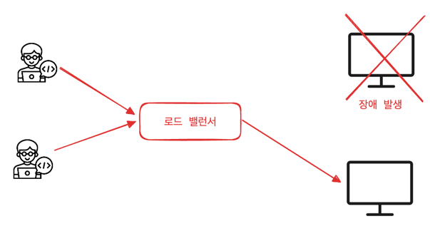
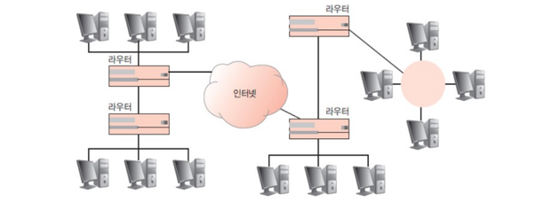

## 네트워크 기기

 

---

### 네트워크 기기의 처리 범위

네트워크 기기는 계층별로 처리 범위를 나눌 수 있다.
- 상위 계층 기기는 하위 계층을 처리할 수 있지만 반대는 불가

| 계층        | 네트워크 기기         |
|-----------|-----------------|
| 애플리케이션 계층 | L7 스위치          |
| 인터넷 계층    | 라우터, L3 스위치     |
| 데이터 링크 계층 | 브리지, L2 tmdnlcl |
| 물리 계층     | NIC, 리피터, AP    |

 

---

### 애플리케이션 계층을 처리하는 기기

**L7 스위치(로드 밸런서)**
- 서버의 부하를 분산
- 클라이언트의 요청을 뒤쪽의 여러 서버로 나눠 시스템이 트래픽을 관리한다.
- URL, 서버, 캐시, 쿠키들을 기반으로 트래픽 분산
- 불필요한 외부 데이터 필터링 기능
- 트래픽 모니터링
- 정기적인 헬스 체크를 이용해 장애가 발생한 서버를 트래픽 분산 대상에서 제외

**L4 스위치 vs L7 스위치**
- L4 스위치(로드 밸런서)
  - 인터넷 계층을 처리하는 기기
    - 스트리밍 관련 서비스에서는 사용 X
    - 메세지를 기반 인식 X
    - IP와 포트를 기반으로 트래픽 분산
- L7 스위치(로드 밸런서)
  - IP, 포트 외에도 헤더, 쿠키 등 여러 정보를 기반으로 트래픽 분산

> 클라우드의 L7 스위치를 사용한 로드밸런싱은 ALB(Application Load Balancer) 컴포넌트를 사용하며 L4 스위치를 사용한 로드밸런싱은 NLB(Network Load Balancer) 컴포넌트 사용

**헬스 체크**
- 전송 주기와 재전송 횟수 등을 설정해 반복적으로 서버에 요청
- 부하가 되지 않을만큼 적절하게 요청 횟수 설정
- TCP, HTTP 등 다양한 방법으로 요청을 테스트

**로드밸런서를 이용한 서버 이중화**

- 로드밸런서의 대표적 기능인 서버 이중화는 안정적인 서비스를 위해 2대 이상의 서버를 운영하는 것이다.
- 에러가 발생해 1대가 다운되어도 나머지 1대로 운영이 가능해야 하는 것
- 로드밸런서는 가상 IP를 제공해 안정적인 트래픽 분산 

 

---

### 인터넷 계층을 처리하는 기기

**라우터**

- 서로 다른 네트워크 간에 통신하는 데 사용하는 장치
- 패킷 소모를 최소화하고 경로를 최적화해 최소 경로로 패킷 포워딩
- 네트워크에서 다른 지역의 컴퓨터와 통신할 때 어느 통신사의 망을 사용할지 결정하는 것은 라우터의 라우팅 프로토콜에 의해 이뤄진다.
  - 라우팅 프로토콜은 네트워크에서 데이터 패킷이 목적지로 전송되는 경로를 결정하는 규칙들의 집합

**L3 스위치**
- L2 스위치 + 라우팅 기능
- L3 스위치를 라우터라고 해도 무방

| 구분     | L2 스위치     | L3 스위치  |
|--------|------------|---------|
| 참조 테이블 | MAC 주소 테이블 | 라우팅 테이블 |
| 참조 PDU | 이더넷 프레임    | IP 패킷   |
| 참조 주소  | MAC 주소 | IP 주소   |

 

---

### 데이터 링크 계층을 처리하는 기기

**L2 스위치**
- MAC (물리주소, 랜카드 하드웨어) 주소를 이용
    - MAC 주소를 이용하다보니 IP주소는 다른데 같은 MAC을 사용해 통신 가능
- 각각의 랜카드마다 고유의 주소가 있어서 그 주소를 기반으로 머신과 머신 간 통신 (Point-to-point)
- 스위치는 목적지 장치에만 데이터를 전송하므로 허브보다 효율적이고 성능이 우수
- 목적지가 MAC 주소 테이블에 없으면 전체 포트에 전달

**브리지**
- 물리적으로 분리된 두 개의 근거리 통신망(LAN)을 상호 접속할 수 있도록 하는 통신망 연결 장치
- 포트와 포트 사이의 다리 역할
- 장치에서 받아온 MAC 주소를 MAC 주소 테이블에 관리

 

---

### 물리 계층을 처리하는 기기

**NIC**
- LAN 카드 (NIC, Network Interface Card)는 2대 이상의 컴퓨터 네트워크를 구성하는 데 사용
- 네트워크와 빠른 속도로 데이터를 송수신할 수 있도록 컴퓨터 내에 설치하는 확장 카드
- 각 LAN은 식별번호 MAC 주소 보유

**리피터(repeater)**
- 들어오는 약해진 신호 정도를 증폭해 전달하는 장치
- 광케이블의 보급으로 잘 사용하지 않음

**AP(Access Point)**
- 패킷을 복사하는 기기
- AP에 유선 LAN을 연결한 후 다른 장치에서 무선 LAN (ex: 와이파이)를 사용해 무선 네트워크 연결 가능

 
