## IP 주소

---

### ARP

컴퓨터 간 통신은 IP 주소에서 ARP(Address Resolution Protocol)를 통해 찾은 MAC 주소를 기반으로 이뤄진다.
- ARP를 통해 가상 주소인 IP 주소를 실제 주소인 MAC 주소로 변환

> 반대로 RARP를 통해 실제 주소인 MAC 주소를 가상 주소 IP로 변환하기도 한다

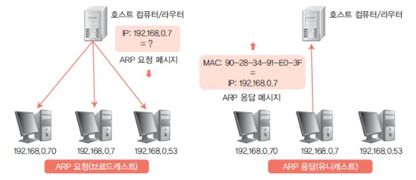
- 주소 변환 프로토콜
- 네트워크 상의 기기가 IP 주소를 이용해 해당 IP 주소가 가진 기기의 물리적 주소(MAC 주소)를 찾아내는 프로토콜
- 왼쪽 그림에서 호스트 컴퓨터/서버가 "192.168.0.7"이라는 IP 주소를 가진 대상의 MAC 주소를 모르기 때문에, 네트워크 상의 다른 모든 기기들에게 ARP 요청 메시지를 브로드캐스트한다.
    - 모든 기기들이 이 메세지를 수신한다.
- 오른쪽 그림은 ARP 응답 메시지를 보내는 과정으로 자신의 IP 주소 "192.168.0.7"에 해당하는 MAC 주소 "90-28-34-91-E0-3F"를 메시지에 포함시켜 송신자에게 직접 보낸다. (유니캐스트)
    - 송신자는 이 메세지를 받고 대상의 MAC 주소를 알게 된다.

 

---

### 홉바이홉 통신

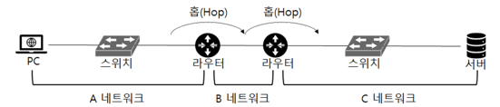

IP 주소를 통해 통신하는 과정을 hop by hop 통신이라고 하는데 hop의 의미는 통신망에서 각 패킷이 여러 개의 라우터를 건너가는 모습을 뜻한다.
- 각각의 라우터에 있는 라우팅 테이블의 IP를 기반으로 패킷을 전달하고 다시 전달해나간다.
- 통신 장치에 있는 라우팅 테이블의 IP를 통해 시작 주소부터 시작해 다음 IP로 계속해서 이동해 IP 주소를 찾아가는 라우팅 과정을 거쳐 패킷이 최종 목적지에 도달하도록 한다.

**라우팅 테이블**
- 목적지 정보들과 그 목적지로 가기 위한 정보 리스트
- 게이트웨이와 모든 목적지에 대해 거쳐야할 다음 라우터의 정보를 가지고 있다.

**게이트웨이**

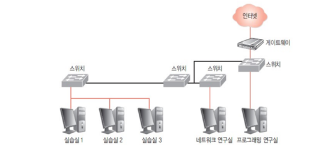

- 서로 다른 통신망, 프로토콜을 사용하는 네트워크 간의 통신이 가능하도록 하는 장치
  - ex) 로컬 네트워크와 인터넷 간의 통신을 가능하게 하는 인터넷 게이트웨이
- 사용자는 인터넷에 접속하기 위해 수많은 게이트웨이를 거친다.
- 게이트웨이는 라우팅 테이블을 통해 확인할 수 있다.
  - `netstat -r`로 라우팅 테이블 확인 가능

 

---

### IP 주소 체계

IP 주소는 32비트를 8비트 단위로 나눠 표기하는 IPv4와 64비트를 16비트 단위로 나눠 표기하는 IPv6로 나뉜다.

**IPv4**

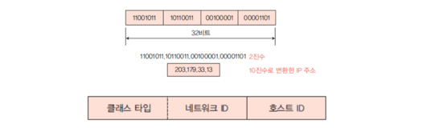

- IP 주소는 8비트 크기의 필드 4개로 구성
- 네트워크 ID와 호스트 ID로 구성

**클래스 기반 할당 방식**
처음에는 A ~ E 5개의 클래스로 구분하는 클래스 기반 할당 방식(CIDR)을 사용했다. 

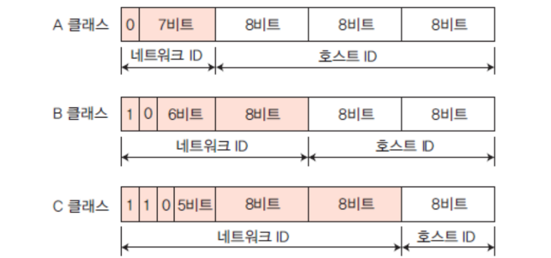

- A, B, C 클래스는 일대일 통신으로 사용
- D 클래스는 멀티캐스트 통신
- E 클래스는 예비용 주소

**A 클래스**

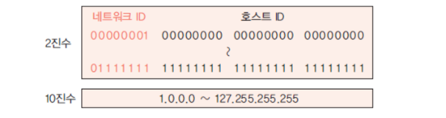

- 구분 비트: 0
- 0.0.0.0 ~ 127.255.255.255
    - 0.x.x.x
        - 0.0.0.0은 모두에게 오픈할 때만 사용한다.
        - 오픈하고 싶은 범위 지정
    - 127.x.x.x
        - 127.0.0.1 루프백
        - 127.0.1.1도 루프백이 됨
    - 따라서 실제 사용 가능한 주소 범위는 1.0.0.0 ~ 126.255.255.255
- 기본 network mask는 255.0.0.0
    - network mask를 IP 주소와 AND 연산을 수행하면 네트워크 부분만 남게 되고 호스트 부분은 전부 0으로 설정된다.
    - 네트워크와 호스트 부분을 구분하는데 사용하는 이진수이다.

**B 클래스**

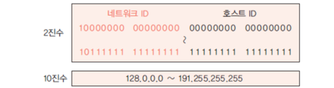

- 구분 비트: 10
- 128.0.0.0 ~ 191.255.255.255
- 기본 network mask는 255.255.0.0

**C 클래스**

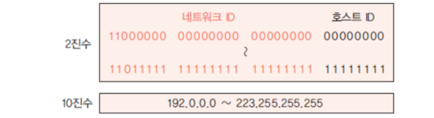

- 구분 비트: 110
- 192.0.0.0 ~ 123.255.255.255
- 기본 network mask는 255.255.255.0
- 대부분의 집 와이파이는 C 클래스
    - 브로드캐스트나 체크해야할 범위가 많아질 수 있어서 C 클래스가 좋음

네트워크의 첫 주소는 네트워크 주소로 사용되고 마지막 주소를 브로드캐스트용 수소로 네트워크에 속해 있는 모든 컴퓨터에 데이터를 보낼 때 사용한다.

> 이 방식은 사용하는 주소보다 버리는 주소가 많은 단점으로 이를 위해 DHCP와 IPv6, NAT 개념이 등장

---

**DHCP(Dynamic Host Configuration Protocol)**
- IP 주소 및 기타 통신 매개변수를 자동으로 할당하기 위한 네트워크 관리 프로토콜
- 네트워크 장치의 IP 주소를 수동으로 설정할 필요 없이 인터넷에 접속할 때마다 자동으로 IP 주소를 할당할 수 있다.
- 많은 라우터 및 게이트웨이에 DHCP 기능이 있으며 이를 통해 대부분의 가정용 네트워크에서 IP 주소를 할당한다.

**NAT(Network Address Translation)**
- 패킷이 라우팅 장치를 통해 전송되는 동안 패킷의 IP 정보를 수정해 다른 주소로 매핑하는 방법
  - 주로 네트워크 계층의 라우터나 방화벽같은 네트워크 장비에서 구현된다.
- IPv4 주소 체계에서 모든 주소를 감당하지 못하는데 이를 위해 NAT로 공인 IP, 사설 IP로 나눠 많은 주소를 처리
- 내부 네트워크와 외부 네트워크 간 통신을 관리하고 중재하는데 내부 네트워크에 속한 호스트들은 사설 IP 주소를 사용하고, 외부 네트워크와 통신할 때에는 라우터를 통해 공인 IP 주소로 변환되어 외부 네트워크와 통신한다.
  - 내부 네트워크에 대한 어느정도의 보안 가능
- 여러 명이 동시에 접속하게 되므로 접속 속도가 느려질 수 잇음

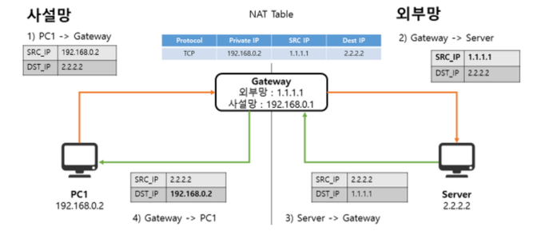

1. PC1 → Gateway
    - 사설 네트워크에 있는 PC1(192.168.0.2)이 공용 네트워크로 데이터를 전송
    - 목적지는 2.2.2.2
2. Gateway → Server
    - Gateway는 NAT 테이블을 사용해 PC1의 사설 IP 주소를 공용 IP 주소(1.1.1.1)로 변환하고 데이터를 인터넷을 통해 서버(2.2.2.2)로 전송한다.
    - 게이트웨이는 외부 IP 주소로 변환할 때 NAT 테이블에 매핑을 저장한다.
3. Server → Gateway
    - 서버가 응답을 보낼 때 목적지 IP는 Gateway의 공용 IP(1.1.1.1)로 설정된다.
    - 데이터 패킷이 Gateway에 도착하면 NAT 테이블을 참조해 실제로 데이터를 보낸 PC1의 사설 IP 주소로 전송된다.
4. Gateway → PC1
    - 응답 패킷이 돌아올 때 NAT 장치(게이트웨이)는 NAT 테이블에 기록된 매핑 정보를 통해 공용 주소에서 사설 네트워크의 해당 IP 주소로 다시 매핑해 PC1으로 전달한다.

**NAT) 만약 두 기기가 동시에 접속을 요청한다면?**

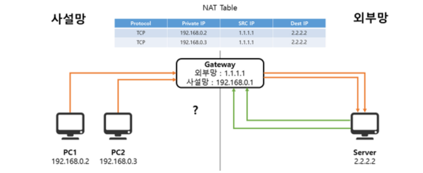

- NAT는 어디 PC로 매핑해야 할지 알 수 없다.

**NAPT (Network Address Port Translation)**

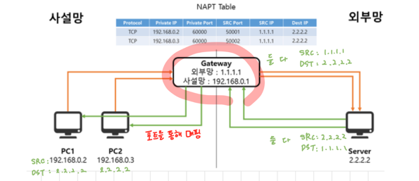

- 사설망 - 외부망 IP 주소를 바꿔서 보내주는 역할(기존의 NAT 기능) + 포트까지 바꿈
- 소스 포트는 랜덤으로 할당된다.

**공유기의 NAT**
- 인터넷 공유기에 NAT 기능이 탑재되어 있기 때문에 인터넷 회선 하나를 개통하고 인터넷 공유기를 통해 여러 PC를 연결해 사용할 수 있었던 것

 

---

### IP 주소를 이용한 위치 정보

IP 주소는 인터넷에서 사용하는 네트워크 주소이기 때문에 동 또는 구 정도의 범위까지는 위치 추적이 가능하다.

 