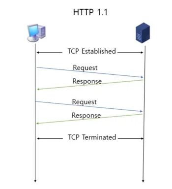
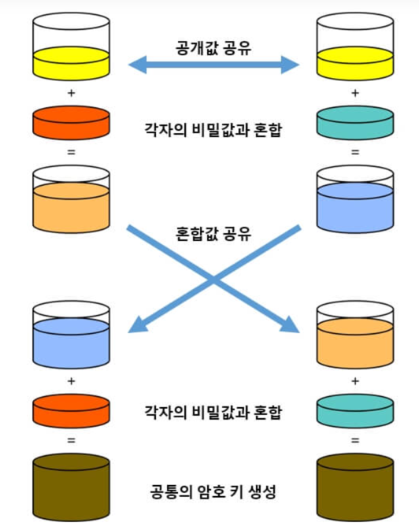

## HTTP

애플리케이션 계층에서 웹 서비스 통신에 사용되는 프로토콜

---

### HTTP/1.0

- 한 연결당 하나의 요청을 처리

**RTT 증가**
- RTT: 패킷 왕복 시간
- 서버로부터 파일을 가져올 때마다 TCP의 3-way handshake를 계속해서 열어야 해서 RTT가 증가한다.

**RTT 증가 해결 방법**
1. 이미지 스플리팅
   - 많은 이미지를 다운로드 받으면 과부하가 걸리기 때문에 많은 이미지가 합쳐져 있는 하나의 이미지를 다운받아 사용하는 방식
2. 코드 압축
   - 개행 문자, 빈칸을 없애 코드의 크기 최소화
3. 이미지 Base64 인코딩
   - 이미지 파일을 64진법으로 이루어진 문자열로 인코딩
   - 서버와의 연결을 열고 이미지에 대해 서버에 HTTP 요청을 할 필요가 없음
   - 단, 크기가 더 커지는 단점

 

---

### HTTP/1.1

매번 TCP 연결을 하는 것이 아닌 한 번 TCP 초기화 이후에 keep-alive 옵션으로 지정한 Timeout 동안 연결을 지속해 여러 번 송수신할 수 있다.
- 다수의 리소스(이미지, css ..)를 처리하려면 요청할 리소스 개수에 비례해서 대기 시간이 길어지는 단점

**HOL Blocking(Head Of Line Blocking)**
- 네트워크에서 같은 큐에 있는 패킷이 그 첫 번째 패킷에 의해 지연될 때 발생하는 성능 저하

**무거운 헤더 구조**
- HTTP/1.1 헤더에는 쿠키 등 많은 메타데이터가 압축 없이 들어있어 무겁다.

 

---

### HTTP/2

웹 페이지 로딩 속도를 높이고 효율성을 향상시키기 위해 다양한 기능이 추가됐다.
- Google의 SPDY 프로토콜에서 발전했다.

**이진 프레이밍 계층**
- 클라이언트와 서버 간 모든 통신은 frame 단위로 나눠지며 Stream 안에서 전송된다.
- 데이터 전송의 효율성과 신뢰성 증가

**멀티플렉싱**
- 단일 TCP 연결을 통해 여러개의 스트림을 사용해 리소스 동시 요청 및 응답 가능
- HOL blocking 방지
- 특정 스트림의 패킷이 손실되어도 해당 스트림에만 영향을 미침
- 병렬적인 스트림을 통해 병렬로 여러 요청 및 응답 가능

**헤더 압축**
- HPACK이라는 헤더 압축 방식을 사용해 헤더 크기를 줄이고 중복되는 헤더 정보를 효율적으로 전송
  - 문자열을 문자 단위로 쪼개 빈도수를 세어 빈도가 높은 정보는 적은 비트 수로, 빈도가 낮은 정보는 비트 수를 많이 사용해서 비트양을 줄이는 원리
- 대역폭 사용을 줄이고 전송 속도를 높인다.

**서버 푸시**
- 서버는 클라이언트가 요청하지 않은 리소스도 미리 전송 가능
- 클라이언트의 요청을 예측하고 필요한 리소스를 미리 제공해 페이지 로딩 속도 향상
  - ex) HTML 페이지를 요청할 때 서버는 해당 페이지에 필요한 css, javaStript 파일 미리 푸시 가능

**스트림 우선순위**
- 클라이언트는 각 스트림에 대해 우선순위를 지정해 응답 순서를 조정할 수 있다.
- 중요한 리소스를 먼저 로드해 사용자 경험을 개선할 수 있다.

 

---

### HTTPS

HTTPS는 애플리케이션 계층과 전송 계층 사이에 신뢰 계층인 SSL/TLS 계층을 넣은 신뢰할 수 있는 HTTP 요청을 뜻한다.
- HTTP/2는 HTTP 위에서 동작
- 통신을 암호화

**SSL(Secure Socket Layer)/TLS(Transport Layer Security Protocol**
- 전송 계층에서 보안을 제공하는 프로토콜
- 제 3자가 메세지를 도청하거나 변하지 못하도록 방지
- 공격자가 서버인 척하며 사용자 정보를 가로채는 인터셉터 공격 방지
- 보안 세션을 기반으로 데이터를 암호화

**보안 세션**
- 보안이 시작되고 끝나는 동안 유지되는 세션
  - handshake로 보안 세션을 생성

클라이언트와 서버가 키를 공유하고 이를 기반으로 인증, 인증 확인 등의 작업이 일어나는 단 한 번의 1-RTT가 생긴 후 데이터를 송수신

1. 클라이언트에서 사이퍼 슈트(cypher suites)를 서버에 전달
2. 서버는 받은 사이퍼 슈트의 암호화 알고리즘 리스트를 제공할 수 있는지 확인
3. 서버에서 클라이언트로 인증서를 보내는 인증 메커니즘 시작
4. 해싱 알고리즘 등으로 암호화된 데이터의 송수신 시작

**사이퍼 슈트**
프로토콜, AEAD 사이퍼 모드, 해싱 알고리즘이 나열된 규약
- 총 5개 존재

**AEAD(Authenticated Encryptino with Associated Data) 사이퍼 모드**
- 데이터 암호화 알고리즘

---

**인증 메커니즘**
- CA(Certificate Authorities)에서 발급한 인증서를 기반으로 인증
  - CA에서 발급한 인증서는 안전한 연결을 시작하기 위한 공개키를 클라이언트에 제공하고 사용자가 접속한 서버가 신뢰할 수 있음을 보장
  - 인증서는 정보, 공개키, 지문, 디지털 서명 등으로 구성

**CA 발급 과정**
1. 사이트 정보와 공개키를 CA에 제출
2. CA는 공개키를 해시한 값인 지문(finger print)를 사용하는 CA의 비밀 키 등을 기반으로 CA 발급

---

**암호화 알고리즘**
키 교환 알고리즘으로는 대수곡선 기반의 ECDHE 또는 모듈식 기반의 DHE를 사용한다.
- 둘 다 디피-헬만 방식을 근간으로 만들어짐

**디피-헬만 키 교환 암호화 알고리즘**
- 보안 통신 채널을 통해 대칭 키를 안전하게 공유할 수 있도록 하는 암호화 알고리즘
- 공개된 정보만으로도 중간에 통신을 가로채는 공격자가 대칭 키를 알아내지 못하게 설계

이렇게 하면 공격자가 개인키 또는 공개키를 가지고도 PSK(사전 합의된 비밀키)가 없어서 아무것도 할 수 없다.

---

**해싱 알고리즘**
- 데이터를 더 작고 섞인 조각으로 만드는 알고리즘
- SSL/TLS는 해싱 알고리즘으로 SHA-256, SHA-384를 사용

**SHA-256 알고리즘**
- 해시 함수의 결괏값이 256비트인 알고리즘
- 비트코인을 비롯한 많은 블록체인 시스템에서도 사용
- 해싱을 해야 할 메세지에 1을 추가하는 등 전처리 후 해시를 반환

> TLS 1.3은 사용자가 이전에 방문한 사이트로 재방문했을 때 보안 세션을 만들기 위한 통신을 하지 않아도 된다. -> 0-RTT

---

**SEO에도 도움이 되는 HTTPS**
HTTPS(SSL 인증서를 사용한 HTTP)는 단순히 보안을 강화하는 것뿐만 아니라, SEO(Search Engine Optimization, 검색엔진 최적화)에도 도움이 된다.
- SEO(Search Engine Optimization): 검색 엔진 최적화
- Google은 SSL 인증서를 강조해왔고 사이트 내 모든 요소가 동일하다면 HTTPS를 사용하는 사이트가 SEO 순위가 더 높을 것이라고 했다.
- SEO를 높여야 사이트에 많은 사용자가 유입되므로 다음 방법들을 사용해야 한다.
  - 캐노니컬 설정
    - 동일한 콘텐츠를 가진 여러 URL이 있을 경우, 검색 엔진이 중복 콘텐츠로 인식하지 않도록 캐노니컬 태그를 사용
  - 메타 설정
    - 메타 태그는 웹페이지의 메타데이터를 설정하여 검색 엔진이 페이지의 내용을 이해하고 색인화하는 데 도움을 준다.
  - 페이지 속도 개선
    - PageSpeedInsights와 같은 사이트에서 서비스의 페이지 속도 리포팅으로 개선할 부분 찾기
    - 이미지 최적화, 캐싱 설정, 불필요한 스크립트 제거 등을 통해 페이지 속도를 개선
  - 사이트맵 관리
    - 웹사이트의 구조를 검색 엔진에 알리는 역할
    - 모든 페이지가 검색 엔진에 의해 색인화될 수 있도록 도와준다.

---

**HTTPS 구축 방법 3가지**
1. 직접 CA에서 ㄱ매한 인증키를 기반으로 구축
2. 서버 앞단의 HTTPS를 제공하는 로드밸런서로 구축
3. 서버 앞단에 HTTPS를 제공하는 CDN으로 구축

 

---

### HTTP/3

TCP 위에서 돌아가는 HTTP/2와는 달리 HTTP/3은 QUIC이라는 계층 위에서 돌아가며 UDP 기반으로 작동한다.

**HTTP/3 특징**
- 멀리플렉싱 가능
- 초기 연결 설정 시 지연 시간 감소
  - QUIC은 TCP를 사용하지 않기 때문에 통신 시작 시 3-way handshake 과정이 필요 없다.
  - 첫 연결 설정에 1-RTT만 소요
- QUIC은 순방향 오류 수정 메커니즘(FEC)이 적용되어 있어서 전송한 패킷이 손실되면 수신 측에서 에러를 검출하고 수정하는 방식이라서 좋지 못한 네트워크 통신 환경에서도 패킷 손실률이 낮다.

 

---

**출처**
- https://oozoowos.tistory.com/entry/%EC%9B%B9-HTTP10-HTTP11-HTTP2-HTTP3-%EC%B0%A8%EC%9D%B4
- https://www.pentasecurity.co.kr/column/%EB%AD%90-%EB%94%94%ED%94%BC-%ED%97%AC%EB%A8%BC-%EC%84%B1%EC%9D%B4-%EB%AC%B4%EB%84%88%EC%A7%84%EB%8B%A4%EA%B3%A0-2/
- https://www.akamai.com/ko/blog/performance/deliver-fast-reliable-secure-web-experiences-http3