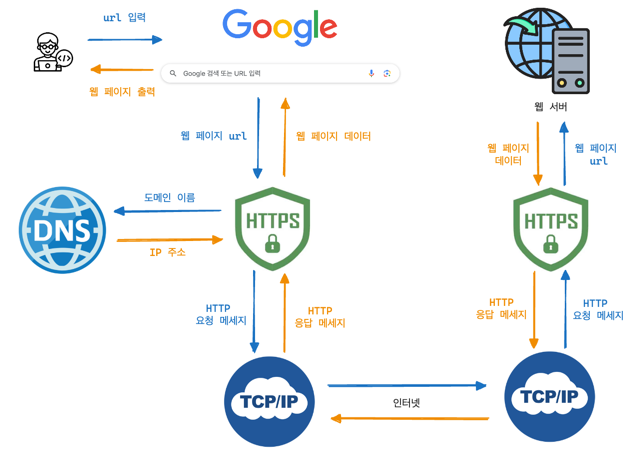

### HTTP 프로토콜에 대해 설명해주세요.

HTTP(Hyper Text Transfer Protocol)은 웹에서 데이터를 주고받기 위해 사용되는 프로토콜로 서버와 웹 브라우저와 같은 클라이언트 간 요청과 응답을 기반으로 동작하는 서버/클라이언트 모델을 따릅니다.

그리고 상태 정보를 저장하지 않아 각 요청을 독립적으로 만드는 무상태(Stateless)의 특징과 클라이언트 요청에 맞는 응답을 보낸 후 연결을 끊는 비연결성의 특징을 가지고 있습니다.

이로 인해 통신간 연결 상태 처리나 상태 정보를 관리할 필요가 없어서 서버의 복잡성을 줄여주고 서버 자원을 효율적으로 사용할 수 있습니다. 하지만 클라이언트의 상태가 유지되지 않아서 서버는 클라이언트가 누구인지 계속 인증을 해줘야 합니다. 이런 방식은 사용성을 떨어뜨릴 수 있으므로 쿠키, 세션과 같은 전략을 사용해 사용자 경험을 향상시킬 필요가 있습니다.

---

### 그렇다면 쿠키, 세션의 차이는 뭔가요? 

둘 다 HTTP 프로토콜의 특징이자 약점인 Stateless를 보완하기 위해 사용합니다.

쿠키는 사용자의 컴퓨터에 저장하는 작은 기록 정보 파일로 HTTP에서 클라이언트, 즉 접속자의 상태 정보를 text 형태로 PC에 저장했다가 필요할 때 참조하거나 재사용할 수 있습니다. 다만 쿠키는 당사자 뿐만 아니라 제 3자가 조회하는 것도 가능하기 때문에 XSS(크로스-사이트 스크립팅)과 같은 보안 취약점에 노출될 수 있습니다.

세션은 일정 시간동안 같은 사용자, 즉 같은 브라우저로부터 들어오는 요청을 하나의 상태로 보고 그 상태를 유지시키는 방법입니다. 각 클라이언트에 고유 세션 ID가 부여되며 이 ID는 쿠키를 통해 관리됩니다. 서버 측에서 사용자 정보를 제어할 수 있어서 보안성이 높지만 서버 자원을 많이 사용하기 때문에 속도가 느려질 수 있습니다.

---

### 캐시와의 차이는 뭔가요?

쿠키와 세션이 사용자의 인증과 같은 정보를 저장하기 위해 사용됐다면 캐시는 웹 페이지 요소를 저장해 빠르게 렌더링하기 위한 목적으로 사용합니다.

캐시는 이미지, 비디오, 오디오 등의 데이터를 미리 복사해 놓는 리소스 파일들의 임시 저장소라고 할 수 있는데요. 여기에 저장된 데이터가 다시 사용될 경우 빠르게 접근할 수 있어 페이지의 로딩 속도를 향상시킬 수 있습니다.

---

### HTTP와 HTTPS의 차이점에 대해 설명해주세요.

HTTP와 HTTPS의 주요 차이점은 보안입니다. HTTP는 데이터를 암호화하지 않고 전송하기 때문에 도청이나 변조에 취약합니다. 이러한 문제를 해결하기 위해 HTTP에 암호화가 추가된 프로토콜이 HTTPS입니다. 

HTTP는 TCP와 직접 통신하는 반면, HTTPS는 SSL(Secure Socket Layer)/TLS(Transport Layer Security Protoco)을 통해 데이터를 암호화한 후 TCP와 통신해 웹사이트의 신뢰성과 안정성을 보장합니다.

---

### www.naver.com에 접속할 대 생기는 과정에 대해 설명해주세요

먼저 사용자가 브라우저에서 url을 입력하면 HTTP 또는 HTTPS 프로토콜을 통해 DNS 서버에 도메인 이름에 해당하는 IP 주소를 요청한 후 찾은 IP 주소로 웹 서버에 TCP 3 handshake 과정을 통해 연결합니다.

연결이 된 상태에서 클라이언트는 웹 서버로 HTTP 요청 메세지를 보내고, 웹 서버는 해당 요청에 대한 HTTP 응답 메세지를 보냅니다. 도착한 HTTP 응답 메세지는 웹 페이지 데이터로 변환되고, 웹 브라우저에 의해 사용자에게 출력됩니다.

---

### TCP와 UDP의 차이를 설명해주세요

TCP와 UDP 모두 인터넷상에서 데이터를 전송하기 위한 프로토콜인데요. TCP는 연결 지향형 프로토콜로 3-way handshaking 과정을 통해 1:1 연결을 하기 때문에 안정적으로, 순서대로, 에러 없는 데이터 송수신을 보장하지만 속도가 비교적 느립니다. 

반면, UDP는 비연결형 서비스로 TCP보다는 신뢰성이 떨어지지만 데이터 수신 여부를 확인하지 않기 때문에 속도가 빠르다는 장점이 있습니다. 그래서 신뢰성이 중요한 파일 교환과 같은 경우엔 TCP를 사용하고, 실시간성이 중요한 스트리밍과 같은 경우엔 UDP를 사용합니다.

---

### TCP의 통신 방식에 대해 더 자세하게 설명해주세요

TCP는 3 way-handshake 과정을 통해 연결을 설정하고, 4 way-handshake 과정을 통해 연결을 해제합니다. 

3 way-handshake는 말그대로 3단계로 진행되는데요. 먼저 클라이언트가 서버로 SYN 패킷을 보내 연결을 요청하면 서버는 클라이언트의 요청을 수락하고 SYN 패킷에 ACK 패킷을 붙여 전송합니다. 클라이언트는 서버의 응답을 확인하고 ACK 패킷을 다시 보내면서 최종적으로 연결됩니다. 

4 way-hanshake는 통신이 끝났을 때 연결을 해제하는 과정으로 클라이언트가 연결 종료를 요청하는 FIN 패킷을 전송하면 서버는 클라이언트의 요청을 확인하고 ACK 패킷을 보낸 후 연결 종료를 요청하는 FIN 패킷을 연달아 보냅니다. 클라이언트는 서버의 요청을 확인하고 ACK 패킷을 보내면서 최종적으로 연결이 해제됩니다.

이런 과정을 통해 TCP는 안정적이고 신뢰성있는 데이터 전송을 보장합니다.

---

### OSI 7 Layer와 각 계층에 대해 설명해주세요

OSI 7 Layer는 네트워크 통신을 7개의 계층으로 나누어 설명하는 모델입니다. 데이터가 계층 간 전달될 때 각 계층마다 다른 PDU(Protocol Data Unit) 단위로 전달됩니다.

상위 계층부터 설명드리자면, 먼저 7계층 Application 계층은 사용자와 통신 서비스를 직접 연결하는 인터페이스 역할의 계층으로 Data 단위를 사용하며 HTTP, FTP, SMTP와 같은 프로토콜을 사용합니다.

6계층인 Presentation은 데이터의 포맷을 정의해 코드 간 번역을 담당하고, 5계층 Session 계층은 통신을 위한 세션을 만들고 관리합니다.

4계층인 Transport 계층은 최종 수신 프로세스로 데이터의 전송을 담당하는 계층입니다. PDU로 Segmnet를 사용하고, TCP, UDP 프로토콜이 있습니다.

3계층인 네트워크 계층은 PDU인 Packet을 목적지까지 가장 효율적이고, 빠른 길로 전송하기 위한 계층으로 라우팅과 패킷 전달을 담당합니다. IP 프로토콜을 통해 패킷을 라우팅합니다.

2계층은 데이터 링크 계층으로 데이터의 물리적인 전송과 에러 검출, 흐름 제어를 담당하며 PDU로 frame을 사용합니다. 이더넷, Wi-Fi 등이 2계층에 해당합니다.

1계층은 물리 계층으로 데이터를 전기 신호로 바꾸어주는 계층입니다. PDU로 bit를 사용하며 케이블, 허브와 같은 물리적인 장비를 의미합니다. 

---

### TCP/IP 4계층을 설명해주세요

TCP/IP 모델은 OSI 7계층을 4계층으로 단순화한 모델로 애플리케이션 계층, 전송 계층, 네트워크 계층, 전송(링크) 계층으로 구성되어 있습니다. 

---

### HTTP Method에 대해 설명해주세요

HTTP Method는 클라이언트가 서버에게 사용자 요청의 목적을 알리는 수단입니다. 

GET은 서버로부터 데이터를 조회하려는 목적으로 웹 페이지를 불러오거나 필요한 데이터를 요청할 때 사용합니다. 

POST는 서버에 데이터를 전송해 처리하려는 목적으로 사용자 등록, 로그인 등 서버에 새로운 데이터를 추가할 때 사용합니다. 

PUT과 PATCH는 모두 서버의 데이터를 변경하려는 목적으로 PUT은 해당 데이터의 전체를 업데이트할 때, PATCH는 데이터의 일부를 업데이트할 때 사용합니다.

DELETE는 데이터를 삭제하려는 목적으로 특정 게시글이나 계정 등을 삭제하는 경우에 사용합니다.

---

### GET과 POST의 차이점에 대해 설명해주세요

GET은 url에 변수를 포함시켜 요청하는 방식으로 url에 데이터가 노출되기 때문에 개인정보가 포함되지 않은 상황에서 캐싱을 통해 빠른 속도로 데이터를 조회할 때 사용합니다.

POST는 데이터를 Body에 담아 요청하기 때문에 비교적 안전하게 데이터 처리를 요청할 수 있습니다. 조회의 경우보다는 데이터를 추가 또는 수정하고 싶을 때 사용합니다. 

데이터의 위치 뿐만 아니라 멱등성에서도 차이가 있는데요. GET은 리소스를 조회만 하므로 여러 번 요청하더라도 응답이 똑같기 때문에 멱등성이 있는 반면, POST는 동일 요청을 여러번 수행하면 서버의 상태가 매번 바뀔 수 있기 때문에 멱등성이 없습니다. 

---

### 세션 기반 인증과 토큰 기반 인증의 차이에 대해 설명해주세요

세션 기반 인증은 클라이언트로부터 요청을 받으면 클라이언트의 상태 정보를 저장하므로 Stateful한 구조를 가지기 때문에 서버 자원을 많이 사용해 속도가 느려질 수 있고, 세션 ID를 쿠키로 관리하기 때문에 악성 공격자가 쿠키를 훔쳐 요청을 보내는 세션 하이재킹과 같은 공격에 취약합니다. 

반면 토큰 기반 인증은 서버가 토큰을 발급하고 클라이언트가 이 토큰을 저장해 요청마다 인증 헤더에 포함시켜 보내는 방식으로 상태를 서버에 저장하지 않고 토큰 자체에 필요한 모든 정보를 포함하기 때문에 Stateless 서버 아키텍처와 조합이 좋습니다. 또한 토큰이 클라이언트 측에서 관리되므로 서버 자원을 절약할 수 있습니다.

---

### 그렇다면 세션 기반 인증과 토큰 기반 인증은 어느 경우에 사용해야 적합한가요?

세션 기반 인증은 서버의 자원을 사용하기 때문에 속도 문제로 단일 도메인이 아닌 이상 사용하지 않는 게 좋습니다. 다만 보안상의 이유로 LinkedIn 처럼 사용자의 활동을 서버에서 직접 관리하고 싶다던지, Microsoft 처럼 다양한 서비스간 통합된 인증 체계를 제공하기 위해서 사용될 수 있습니다.

토큰 기반 인증은 특히 사용자 인증과 같이 민감한 정보를 처리할 때 적합합니다. JWT와 같은 토큰을 통해 자체적으로 인증 정보를 포함하고 이를 클라이언트에서 관리하도록 해 서버의 부담을 줄여줍니다.  

---

### JWT 토큰에 대해 설명해주세요

JWT 토큰은 JSON 포맷을 사용하는 Claim 기반의 웹 토큰으로 토큰 자체를 정보로 사용하는 Self-Contained 방식으로 정보를 안전하게 전달합니다. 

JWT 토큰은 토큰의 타입과 해시 암호화 알고리즘이 명시된 Header와 JSON 포맷의 Claim이 들어있는 Payload, 토큰의 서명을 위한 고유 key가 담긴 Signature로 구성되어 있습니다.

실제로 저도 프로젝트에 사용자 인증을 위해 JWT 토큰을 매번 사용했는데요. JWT 토큰은 클라이언트에서 관리되기 때문에 한 번 탈취당하면 토큰의 만료기한까지 탈취자가 그 토큰의 주인처럼 행동할 수 있고, 특정 사용자의 토큰을 강제로 만료시키기도 어렵다는 단점이 있습니다.

저는 그래서 토큰의 만료 기한을 최대한 짧게 설정해서 탈취되더라도 피해를 최소화할 수 있도록 했고, 만료 시 매번 재로그인이 아닌 자동으로 재발급 받을 수 있도록 Refresh Token을 함께 사용했습니다. 또한 이 모든 토큰을 Redis 캐시 서버에서 관리해 빠르게 인증과 재발급 과정이 이루어지도록 했고, Access Token을 사용자당 하나만 유지할 수 있도록 철저하게 관리했습니다.

---

### 대칭키, 비대칭키 암호화 방식에 대해 설명해주세요.

대칭키, 비대칭키 모두 양방향 암호화 방식인데요.

대칭키 암호화는 암호화와 복호화에 같은 암호키를 사용하는 알고리즘으로 빠르고 효율적이지만 키가 탈취된 순간 정보가 전부 유출되기 때문에 보안성이 떨어집니다. 대표적으로 AES, DES 알고리즘이 있습니다.

이러한 문제를 보완한 방식이 비대칭키(공개키) 암호화입니다. 암호화와 복호화할 때 서로 다른 키를 사용하는 알고리즘으로 누구나 접근할 수 있는 공개키로 데이터를 암호화하고, 오직 개인키를 통해서만 복호화할 수 있는 방법입니다. 대표적으로 RSA, ECC 알고리즘이 있습니다.

대칭키 암호화는 주로 대량의 데이터를 빠르게 암호화할 때 적합하고, 비대칭키 암호화는 디지털 서명, 인증 등의 민감한 데이터의 암호화를 목적으로 사용됩니다.

---

### Connection Timeout과 Read Timeout의 차이에 대해 설명해주세요

Connection Timeout은 클라이언트가 서버에 접속을 시도할 때 서버에 연결하기까지의 시간 제한을 의미합니다. 클라이언트가 서버에 접근을 시도했으나 서버가 응답하지 않아서 설정된 시간 내에 연결이 안된 경우 발생합니다. 주로 서버가 다운되었거나 네트워크 문제로 서버에 도달하지 못했을 때 발생합니다.

Read Timeout은 클라이언트가 서버에 접속을 성공한 후, 서버가 요청을 처리하고 응답을 반환하는 데 걸리는 시간의 제한을 의미합니다. 클라이언트가 서버에 요청을 보냈는데 서버에서 로직을 수행하는 시간이 너무 길어 응답을 받지 못하는 경우에 발생합니다. 이 때 클라이언트는 연결을 해제하는 등의 대처를 하지만 서버는 여전히 처리중이라서 상태 불일치 문제가 발생할 수 있습니다.

---

### 그렇다면 그 상태 불일치 문제는 어떻게 해결하나요?

타임아웃이 발생했을 시 요청을 다시 시도하는 재시도 로직을 구현하고, 지수 백오프를 통해 재시도 간격을 점차 늘려가 서버의 과부하를 방지하면서 재시도할 수 있도록 할 수 있습니다.

아니면 클라이언트와 서버가 요청의 상태를 주기적으로 확인하고 동기화하도록 별도의 API를 사용하는 방법도 있을 것 같구요.

아예 작업 대기열 큐를 통해 요청을 대기열에 넣고 서버가 비동기적으로 처리한 후 클라이언트에 알림을 보내는 방식으로 동기화 문제를 해결할 수도 있을 것 같습니다.

---

### 공인 IP와 사설 IP의 차이에 대해 설명해주세요

공인 IP는 ISP(Internet Service Provider)가 제공하는 고유한 IP 주소로, 외부에 공개되어 있는 IP 주소입니다. 따라서 인터넷 상의 모든 장치가 이 주소를 통해 인터넷에 연결할 수 있습니다.

사설 IP는 가정이나 회사 내에 할당된 네트워크 IP 주소로, IPv4의 주소 부족 문제를 해결하기 위해 서브넷팅된 IP 주소입니다. 라우터(공유기)에 의해 로컬 네트워크 상의 PC나 장치에 할당되고, 내부 네트워크에서만 사용되기 때문에 인터넷 상에서는 직접 사용할 수 없습니다.

사설 IP 주소만으로는 인터넷에 직접 연결할 수 없고, 라우터를 통해 공인 IP를 할당 받아 외부와 통신할 수 있습니다. 이를 통해 하나의 공인 IP 주소로 사설 IP 주소가 할당된 여러 장치가 인터넷에 연결될 수 있습니다.

