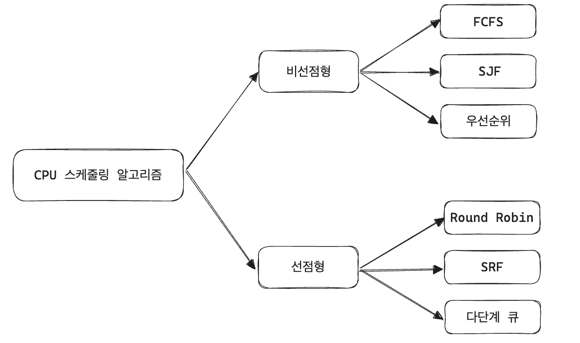

## CPU 스케줄링 알고리즘

CPU 스케줄러는 CPU 스케줄링 알고리즘에 따라 프로세스에 해야 하는 일을 스레드 단위로 CPU에 할당한다. 알고리즘은 CPU 이용률은 높게, 주어진 시간안에 많은 일을 하도록, 준비 큐의 프로세스는 최대한 적게, 응답 시간은 짧게 설정하는 것을 목표로 한다.

 

---

### 비선점형(non-preemptive) 알고리즘

- 프로세스가 스스로 CPU 소유권을 포기하는 방식
- 강제로 프로세스를 중지하지 않기 때문에 컨텍스트 스위칭 부하가 적음

**FCFS(First Come, First Served)**

- 먼저 온 걸 먼저 처리
- 먼저 온 게 오래 걸리면 준비 큐에서 다른 작업이 오래 기다려야 하는 convoy effect 발생

**SJF(Shortest Job First)**

- 실행 시간이 가장 짧은 프로세스를 먼저 실행
- 긴 실행 시간의 프로세스가 기아 상태에 빠질 수 있음

**우선순위**

- 오래된 작업일수록 우선순위를 높임(aging)

 

---

### 선점형(preemptive) 방식

- 현대 운영체제가 채틱한 방식으로 실행중인 프로세스를 알고리즘에 의해 중단시키고 강제로 다른 프로세스에 CPU 소유권을 할당하는 방식

**RR(Round Robin)**

- 현대 컴퓨터가 채택한 알고리즘으로 각 프로세스에 동일한 할당 시간을 주고 그 시간 안에 끝나지 않으면 다시 준비 큐에 들어가는 방식
- q 만큼의 할당 시간이 부여되고 N개의 프로세스가 운영된다고 하면 `(N-1)*q` 시간이 지나면 자기 차례가 온다.
- 할당 시간이 너무 클 경우 FCFS가 되어버리고 너무 작을 경우 컨텍스트 스위칭이 자주 발생해 오버헤드, 즉 비용이 커진다.

**SRF(Shortest Remaining Time First)**

- 중간에 더 짧은 작업이 들어오면 수행하던 프로세스를 중단하고 해당 프로세스 실행

**다단계 큐**

- 우선순위에 따른 준비 큐를 여러 개 사용
- 큐마다 RR이나 FCFS 등 다른 스케줄링 알고리즘 적용
- 큐 간의 프로세스 이동이 안되므로 스케줄링 부담은 적지만 유연성이 떨어짐

 

---

 

---

 

---

 

---

 

---

 

---

 

---

 

---

