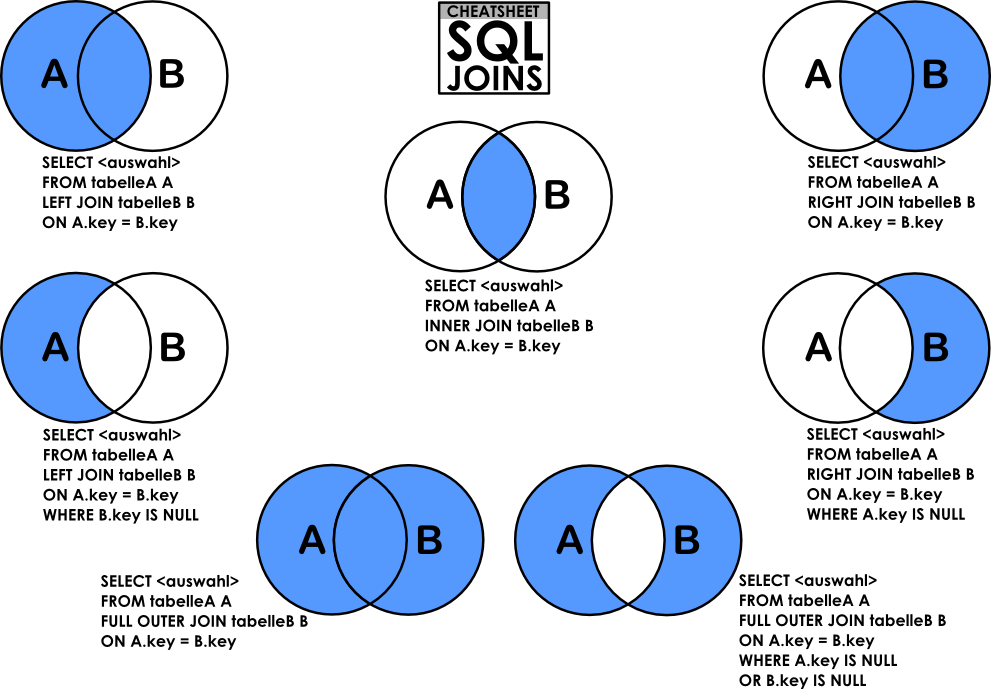

## 조인의 종류

두 개 이상의 테이블을 묶어서 하나의 결과물을 만드는 것을 조인이라고 한다.
- MySQL: JOIN
- MongoDB: lookup

> 몽고디비의 조인은 성능이 좋지 않기 때문에 관계형 디비에서 조인을 사용하는 것이 좋다.


<br/>

---



### 내부 조인 (inner join)

- A, B 두 테이블 간 교집합
```sql
SELECT * FROM A
INNER JOIN B ON A.key = B.key
```

### 왼쪽 조인

- B의 일치하는 부분의 레코드와 함께 A를 기준으로 완전한 레코드 집합 생성
- B에 일치하는 항목이 없으면 null
```sql
SELECT * FROM A
LEFT JOIN B ON A.key = B.key
```

### 오른쪽 조인

```sql
SELECT * FROM A
RIGHT JOIN B ON A.key = B.key
```

### 합집합 조인

- A, B에서 일치하는 레코드와 함께 A, B의 모든 레포드 집합 생성
- 일치하는 항목이 없으면 누락된 쪽에 null 값 포함해 출력

```sql
SELECT * FROM A
FULL OUTER JOIN B ON A.key = B.key
```

<br/>

---

## 조인의 원리

### 중첩 루프 조인(NLJ, Nested Loop Join)

- 중첩 for문과 같은 원리로 두 테이블 간의 모든 조합을 검사하여 조건에 맞는 레코드를 찾는 방식
- 랜덤 접근에 대한 비용이 많이 증가하므로 대용량 테이블에서는 사용하지 않는다.
- 데이터량이 적거나, 인덱스가 잘 설정되어 있는 경우 사용

### 정렬 병합 조인

- 각 테이블을 조인할 필드 기준으로 정렬한 후 조인 수행
- 조인할 때 쓸 적절한 인덱스가 없고 대용량의 테이블들을 조인하고 조인 조건으로 `<`,`>` 등 범위 비교 연산자가 있을 때 사용
- 대량의 데이터에서 성능이 상대적으로 좋지만 인덱스가 없거나 정렬된 상태가 아닌 경우 성능이 저하될 수 있다.

### 해시 조인

- 하나의 테이블을 메모리에 로드하여 해시 테이블을 빌드하고, 다른 테이블을 스캔하면서 해시 테이블을 참조하여 조인을 수행
- 두 테이블을 조인한다고 했을 때 하나의 테이블이 메모리에 온전히 들어가면 보통 중첩 루프 조인보다 더 효율적
- 동등(`==`) 조인에서만 사용 가능
- MySQL 8부터 지원

**해시 조인의 과정**

1. 빌드 단계
    - 입력 테이블 중 바이트가 더 작은 테이블을 기반으로 메모리 내 해시 테이블을 빌드
    - 조인에 사용되는 필드가 해시 테이블의 키로 사용

2. 프로브 단계
    - 레코드 읽기 시작
    - 해시 테이블을 기반으로 일치하는 레코드를 찾아서 결과로 반환

> 이로 인해 각 테이블을 한 번씩만 읽게 되어 중첩 루프 조인보다 보통 성능이 좋다.

<br/>

---

**출처**

- https://doh-an.tistory.com/30
